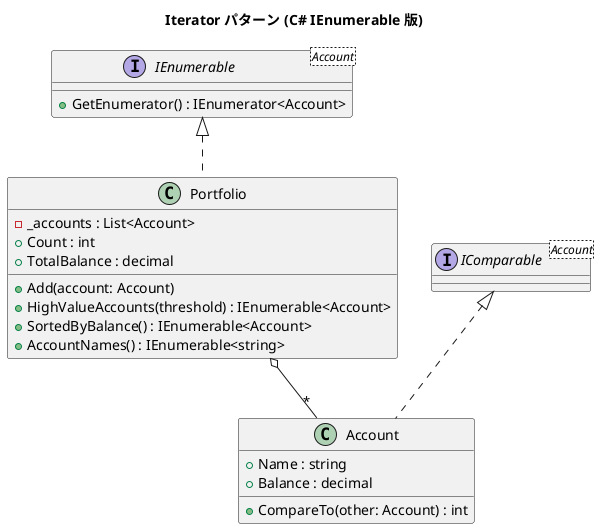

# 第 8 章: Iterator

## はじめに

ポートフォリオ内の口座を順に処理したい場合、内部のデータ構造を公開せずに要素にアクセスする方法が必要です。

**Iterator パターン**は、コレクションの内部表現を公開せずに要素を順にアクセスする方法を提供します。C# では `IEnumerable<T>` と LINQ がこのパターンを言語レベルでサポートします。

---

## パターンの構造



---

## TDD で作る

### Red: テストを書く

```csharp
[Fact]
public void Portfolio_HighValueAccounts_FiltersCorrectly()
{
    var portfolio = CreateSamplePortfolio();
    var highValue = portfolio.HighValueAccounts(1000m).ToList();

    Assert.Equal(2, highValue.Count);
}

[Fact]
public void Portfolio_SortedByBalance_ReturnsAscending()
{
    var portfolio = CreateSamplePortfolio();
    var sorted = portfolio.SortedByBalance().ToList();

    Assert.Equal("Checking", sorted[0].Name);
    Assert.Equal("Investment", sorted[2].Name);
}
```

### Green: 最小限の実装

```csharp
public class Portfolio : IEnumerable<Account>
{
    private readonly List<Account> _accounts = new();

    public IEnumerable<Account> HighValueAccounts(decimal threshold) =>
        _accounts.Where(a => a.Balance >= threshold);

    public IEnumerable<Account> SortedByBalance() =>
        _accounts.OrderBy(a => a);

    public IEnumerator<Account> GetEnumerator() =>
        _accounts.GetEnumerator();

    IEnumerator IEnumerable.GetEnumerator() => GetEnumerator();
}
```

---

## C# ならではのポイント

### LINQ による宣言的処理

```csharp
// 手続き的（Java 的）
var result = new List<Account>();
foreach (var a in _accounts)
{
    if (a.Balance >= threshold) result.Add(a);
}

// 宣言的（C# LINQ）
var result = _accounts.Where(a => a.Balance >= threshold);
```

### ユーティリティプロパティとメソッド

`Portfolio` には反復処理以外にも便利なプロパティとメソッドがあります。

```csharp
// 口座数
public int Count => _accounts.Count;

// 全口座の合計残高
public decimal TotalBalance => _accounts.Sum(a => a.Balance);

// 口座名の一覧を射影
public IEnumerable<string> AccountNames() => _accounts.Select(a => a.Name);
```

`Count` は口座数を返し、`TotalBalance` は LINQ の `Sum()` で全口座の残高合計を計算します。`AccountNames()` は `Select()` で口座名だけを射影して返します。これらはすべてコレクションの内部構造を公開せずにアクセスを提供しています。

### IComparable<T> でソート

```csharp
public class Account : IComparable<Account>
{
    public int CompareTo(Account? other) =>
        Balance.CompareTo(other?.Balance ?? 0);
}
```

---

## 他言語との比較

| 観点 | Ruby | Python | C# |
|------|------|--------|-----|
| イテレータ | Enumerable | `__iter__` / Generator | `IEnumerable<T>` |
| フィルタ | `select` | リスト内包表記 | `.Where()` |
| ソート | `sort_by` | `sorted()` | `.OrderBy()` |
| 射影 | `map` | `map()` | `.Select()` |

---

## まとめ

- Iterator パターンはコレクションの**内部構造を隠蔽**しつつ要素アクセスを提供する
- C# では `IEnumerable<T>` を実装するだけで `foreach` や LINQ が使える
- LINQ により**宣言的**にフィルタ、ソート、射影を記述できる
