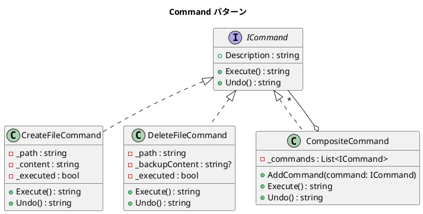

# 第 9 章: Command

## はじめに

ファイル操作（作成・削除）を実行し、必要に応じて取り消し（Undo）したいとします。操作をオブジェクトとしてカプセル化すれば、実行と取り消しを統一的に扱えます。

**Command パターン**は、操作をオブジェクトとしてカプセル化し、実行・取り消し・キューイングを可能にするパターンです。

---

## パターンの構造



---

## TDD で作る

### Red: テストを書く

```csharp
[Fact]
public void CreateFileCommand_Undo_DeletesFile()
{
    var cmd = new CreateFileCommand("test.txt", "hello");
    cmd.Execute();
    var result = cmd.Undo();

    Assert.Contains("Deleted file 'test.txt'", result);
}

[Fact]
public void CompositeCommand_UndoInReverseOrder()
{
    var composite = new CompositeCommand();
    composite.AddCommand(new CreateFileCommand("a.txt", "aaa"));
    composite.AddCommand(new CreateFileCommand("b.txt", "bbb"));
    composite.Execute();

    var result = composite.Undo();
    var lines = result.Split('\n');

    Assert.Contains("b.txt", lines[0]); // 逆順でUndoされる
    Assert.Contains("a.txt", lines[1]);
}
```

### Green: 最小限の実装

```csharp
public class CompositeCommand : ICommand
{
    private readonly List<ICommand> _commands = new();

    public string Undo()
    {
        var results = _commands.AsEnumerable().Reverse().Select(c => c.Undo());
        return string.Join("\n", results);
    }
}
```

### Description プロパティと状態追跡

`ICommand` インターフェースには `Description` プロパティが含まれており、各コマンドが自身の操作内容を文字列で説明できます。

```csharp
public interface ICommand
{
    string Execute();
    string Undo();
    string Description { get; }
}
```

各コマンドは `_executed` フラグで実行状態を追跡します。これにより、未実行のコマンドに対する Undo を安全に防止できます。

```csharp
public string Undo()
{
    if (!_executed)
        return $"Cannot undo: file '{_path}' was never created";

    _executed = false;
    return $"Deleted file '{_path}'";
}
```

`DeleteFileCommand` では、`Execute()` 時に `_backupContent` へバックアップ内容を保存し、`Undo()` 時にそれを使ってリストアします。これはコマンドの**元に戻す**操作に必要な情報をコマンド自身が保持する設計です。

---

## 他言語との比較

| 観点 | Ruby | C# |
|------|------|-----|
| Command 表現 | Proc / クラス | `ICommand` インターフェース |
| Undo | 手動管理 | `ICommand.Undo()` |
| Composite | 配列 | `CompositeCommand` (型安全) |
| 逆順 Undo | `reverse_each` | LINQ `.Reverse()` |

---

## まとめ

- Command パターンは**操作をオブジェクト化**し、実行・取り消しを統一的に扱う
- `ICommand` インターフェースで Execute / Undo の契約を明確にする
- CompositeCommand で複数のコマンドを束ねて一括実行・取り消しが可能
