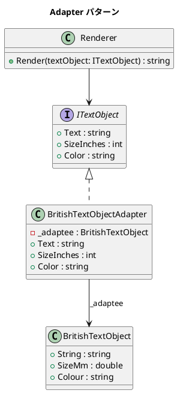

# 第 10 章: Adapter

## はじめに

既存のイギリス式テキストオブジェクト（`String` / `SizeMm` / `Colour`）を、アメリカ式のインターフェース（`Text` / `SizeInches` / `Color`）に合わせて使いたいとします。

**Adapter パターン**は、既存クラスのインターフェースをクライアントが期待するインターフェースに変換するパターンです。

---

## パターンの構造



---

## TDD で作る

### Red: テストを書く

```csharp
[Fact]
public void Adapter_ConvertsMmToInches()
{
    var british = new BritishTextObject { SizeMm = 25.4 };
    ITextObject adapted = new BritishTextObjectAdapter(british);

    Assert.Equal(1, adapted.SizeInches);
}

[Fact]
public void Renderer_CanRenderAdaptedObject()
{
    var british = new BritishTextObject
    {
        String = "Adapted", SizeMm = 50.8, Colour = "blue"
    };
    var adapted = new BritishTextObjectAdapter(british);
    var renderer = new Renderer();

    var result = renderer.Render(adapted);
    Assert.Contains("Adapted", result);
    Assert.Contains("2in", result);
}
```

### Green: 最小限の実装

```csharp
public class BritishTextObjectAdapter : ITextObject
{
    private readonly BritishTextObject _adaptee;
    private const double MmPerInch = 25.4;

    public int SizeInches
    {
        get => (int)(_adaptee.SizeMm / MmPerInch);
        set => _adaptee.SizeMm = value * MmPerInch;
    }
    // ...
}
```

---

## 他言語との比較

| 観点 | Ruby | C# |
|------|------|-----|
| Adapter の実装 | `method_missing` / 委譲 | インターフェース実装 |
| 型安全性 | Duck Typing | コンパイル時検証 |
| プロパティ変換 | メソッド定義 | C# プロパティ (get/set) |

---

## まとめ

- Adapter パターンは**互換性のないインターフェース**を変換する
- C# ではインターフェースを実装し、内部で Adaptee に委譲する
- プロパティの get/set で双方向の変換を自然に表現できる
