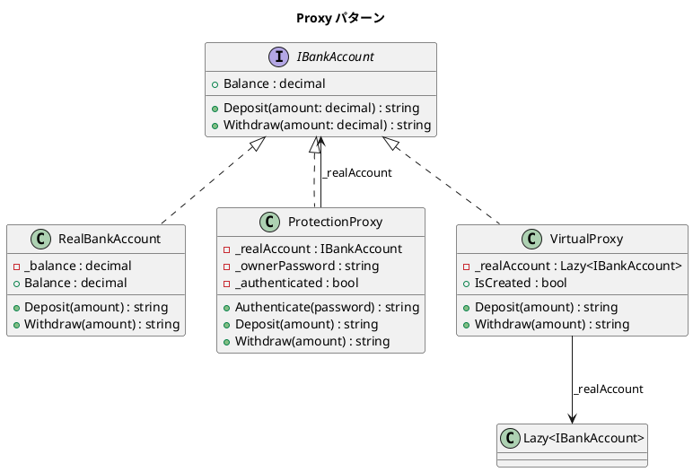

# 第 11 章: Proxy

## はじめに

銀行口座へのアクセスを制御したい（認証が必要）、または口座オブジェクトの生成コストが高いため遅延初期化したいとします。

**Proxy パターン**は、あるオブジェクトへのアクセスを制御するための代理オブジェクトを提供するパターンです。

---

## パターンの構造



---

## TDD で作る

### Red: テストを書く

```csharp
[Fact]
public void ProtectionProxy_DeniesAccessWithoutAuth()
{
    var real = new RealBankAccount(100m);
    var proxy = new ProtectionProxy(real, "secret123");

    var result = proxy.Deposit(50m);
    Assert.Contains("Access denied", result);
}

[Fact]
public void VirtualProxy_DoesNotCreateUntilAccessed()
{
    var proxy = new VirtualProxy(() => new RealBankAccount(100m));

    Assert.False(proxy.IsCreated);
}

[Fact]
public void VirtualProxy_CreatesOnFirstAccess()
{
    var proxy = new VirtualProxy(() => new RealBankAccount(100m));
    var balance = proxy.Balance;

    Assert.True(proxy.IsCreated);
    Assert.Equal(100m, balance);
}
```

### Green: 最小限の実装

```csharp
public class VirtualProxy : IBankAccount
{
    private readonly Lazy<IBankAccount> _realAccount;

    public VirtualProxy(Func<IBankAccount> factory)
    {
        _realAccount = new Lazy<IBankAccount>(() =>
        {
            _log.Add("Creating real bank account (lazy initialization)");
            return factory();
        });
    }

    public bool IsCreated => _realAccount.IsValueCreated;
    public decimal Balance => _realAccount.Value.Balance;
}
```

---

## C# ならではのポイント

### `Lazy<T>` による遅延初期化

```csharp
// Lazy<T> はスレッドセーフな遅延初期化を提供
private readonly Lazy<IBankAccount> _realAccount;

// IsValueCreated でオブジェクトが生成済みかを確認
public bool IsCreated => _realAccount.IsValueCreated;

// .Value にアクセスした時点で初めてファクトリが実行される
public decimal Balance => _realAccount.Value.Balance;
```

---

## 他言語との比較

| 観点 | Ruby | Python | C# |
|------|------|--------|-----|
| Virtual Proxy | `method_missing` | `__getattr__` | `Lazy<T>` |
| Protection Proxy | 手動チェック | デコレータ | 手動チェック + `event` |
| スレッド安全性 | なし（GIL依存） | なし（GIL依存） | `Lazy<T>` (組み込み) |

---

## まとめ

- Proxy パターンは**アクセス制御**や**遅延初期化**をオブジェクトの代理で実現する
- Protection Proxy: 認証による保護
- Virtual Proxy: `Lazy<T>` による遅延初期化（スレッドセーフ）
- 同じインターフェースを実装することで、クライアントは Proxy と本物を区別しない
