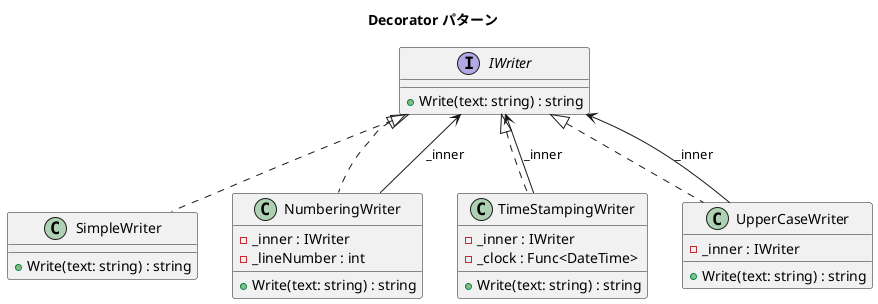

# 第 12 章: Decorator

## はじめに

テキスト出力に行番号を付けたり、タイムスタンプを付けたり、大文字に変換したりしたいとします。これらの機能を自由に組み合わせたい場合、継承では爆発的にサブクラスが増えてしまいます。

**Decorator パターン**は、オブジェクトに動的に新しい機能を追加するパターンです。

---

## パターンの構造



---

## TDD で作る

### Red: テストを書く

```csharp
[Fact]
public void NumberingWriter_AddsLineNumbers()
{
    var writer = new NumberingWriter(new SimpleWriter());

    Assert.Equal("1: hello", writer.Write("hello"));
    Assert.Equal("2: world", writer.Write("world"));
}

[Fact]
public void CanStackDecorators_AllThree()
{
    var fixedTime = new DateTime(2025, 1, 15, 10, 30, 0);
    var writer = new NumberingWriter(
        new TimeStampingWriter(
            new SimpleWriter(), () => fixedTime));

    var result = writer.Write("hello");
    Assert.Contains("1:", result);
    Assert.Contains("2025-01-15", result);
}
```

### Green: 最小限の実装

```csharp
public class NumberingWriter : IWriter
{
    private readonly IWriter _inner;
    private int _lineNumber;

    public string Write(string text)
    {
        _lineNumber++;
        return _inner.Write($"{_lineNumber}: {text}");
    }
}
```

### Refactor: テスト可能な時刻注入

```csharp
public class TimeStampingWriter : IWriter
{
    private readonly IWriter _inner;
    private readonly Func<DateTime> _clock;

    public TimeStampingWriter(IWriter inner, Func<DateTime>? clock = null)
    {
        _inner = inner;
        _clock = clock ?? (() => DateTime.Now);
    }
}
```

`Func<DateTime>` を注入することで、テスト時に固定時刻を使用できます。

### UpperCaseWriter の追加

テキストを大文字に変換するデコレータを追加します。

```csharp
[Fact]
public void UpperCaseWriter_ConvertsToUpperCase()
{
    var writer = new UpperCaseWriter(new SimpleWriter());

    Assert.Equal("HELLO", writer.Write("hello"));
}
```

実装はシンプルに `ToUpper()` を呼び出して内側の `IWriter` に委譲します。

```csharp
public class UpperCaseWriter : IWriter
{
    private readonly IWriter _inner;

    public UpperCaseWriter(IWriter inner)
    {
        _inner = inner;
    }

    public string Write(string text) => _inner.Write(text.ToUpper());
}
```

3 つのデコレータを自由に組み合わせることで、行番号付き・タイムスタンプ付き・大文字変換をどの順序でも積み重ねられます。

---

## 他言語との比較

| 観点 | Ruby | Python | C# |
|------|------|--------|-----|
| Decorator | Module の extend | `@decorator` | インターフェース実装 |
| チェイン | 動的 mixin | ラッパー関数 | コンストラクタチェイン |
| テスト用時刻 | Time のスタブ | `unittest.mock` | `Func<DateTime>` 注入 |

---

## まとめ

- Decorator パターンは**機能を動的に積み重ねる**ことができる
- 同じインターフェースを実装し、内部に別の `IWriter` を保持することでチェインを形成
- `Func<DateTime>` の注入により、テスタビリティを確保
- 継承ベースの解決策と比較して、組み合わせの自由度が高い
