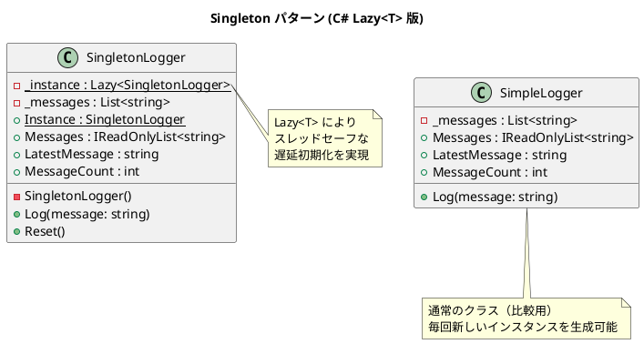

# 第 13 章: Singleton

## はじめに

アプリケーション全体で 1 つのログインスタンスを共有したいとします。複数のインスタンスが存在すると、ログが分散してしまいます。

**Singleton パターン**は、クラスのインスタンスが 1 つしか存在しないことを保証し、そのグローバルなアクセスポイントを提供するパターンです。

---

## パターンの構造



---

## TDD で作る

### Red: テストを書く

```csharp
[Fact]
public void SingletonLogger_ReturnsSameInstance()
{
    var logger1 = SingletonLogger.Instance;
    var logger2 = SingletonLogger.Instance;

    Assert.Same(logger1, logger2);
}

[Fact]
public void SingletonLogger_SharedState()
{
    SingletonLogger.Instance.Reset();
    SingletonLogger.Instance.Log("shared message");

    Assert.Equal("shared message", SingletonLogger.Instance.LatestMessage);
}
```

### Green: 最小限の実装

```csharp
public sealed class SingletonLogger
{
    private static readonly Lazy<SingletonLogger> _instance =
        new(() => new SingletonLogger());

    private readonly List<string> _messages = new();

    private SingletonLogger() { }

    public static SingletonLogger Instance => _instance.Value;

    public void Log(string message) => _messages.Add(message);

    public IReadOnlyList<string> Messages => _messages;

    public string LatestMessage => _messages.LastOrDefault() ?? string.Empty;

    public void Reset() => _messages.Clear();
}
```

単にインスタンスを返すだけでなく、共有状態を読むところまで実装して初めて Singleton の挙動を確認できます。

### SimpleLogger との比較: なぜ Singleton が必要か

まず、通常のクラスとして `SimpleLogger` を考えます。

```csharp
public class SimpleLogger
{
    private readonly List<string> _messages = new();

    public void Log(string message) => _messages.Add(message);

    public IReadOnlyList<string> Messages => _messages.AsReadOnly();

    public string LatestMessage => _messages.Count > 0 ? _messages[^1] : "";

    public int MessageCount => _messages.Count;
}
```

`SimpleLogger` はインスタンスごとに独立したメッセージリストを持つため、異なる箇所で `new SimpleLogger()` するとログが分散します。`SingletonLogger` はアプリケーション全体で 1 つのインスタンスを共有するため、すべてのログが 1 箇所に集約されます。

### MessageCount プロパティと Reset メソッド

`MessageCount` はログに記録されたメッセージの件数を返します。`Reset()` はテスト用にメッセージリストをクリアするメソッドで、`internal` アクセス修飾子により同一アセンブリ内からのみ呼び出せます。

```csharp
public int MessageCount => _messages.Count;

// For testing only
internal void Reset() => _messages.Clear();
```

Singleton はグローバルな状態を持つため、テスト間で状態が共有されてしまいます。`Reset()` を用意することで、各テストの前にクリーンな状態を作ることができます。

---

## C# ならではのポイント

### `Lazy<T>` によるスレッドセーフ実装

```csharp
// .NET の Lazy<T> はデフォルトで LazyThreadSafetyMode.ExecutionAndPublication
// つまり、マルチスレッド環境でも安全に初期化される
private static readonly Lazy<SingletonLogger> _instance =
    new(() => new SingletonLogger());
```

### `sealed` キーワード

```csharp
// sealed で継承を禁止し、Singleton の保証を強化
public sealed class SingletonLogger { }
```

### 古い実装方法との比較

```csharp
// ダブルチェックロッキング（古い方法 - 不要）
private static volatile SingletonLogger? _instance;
private static readonly object _lock = new();

// Lazy<T>（推奨 - 簡潔でスレッドセーフ）
private static readonly Lazy<SingletonLogger> _instance =
    new(() => new SingletonLogger());
```

---

## 他言語との比較

| 観点 | Ruby | Python | C# |
|------|------|--------|-----|
| 実装方法 | モジュール変数 | `__new__` / モジュール | `Lazy<T>` |
| スレッド安全性 | GIL 依存 | GIL 依存 | `Lazy<T>` (組み込み) |
| 継承防止 | 不可 | 不可 | `sealed` キーワード |
| コンストラクタ制御 | `private_class_method` | `__init__` | `private` コンストラクタ |

---

## まとめ

- Singleton パターンは**唯一のインスタンス**を保証する
- C# では `Lazy<T>` により、スレッドセーフな遅延初期化を簡潔に実装できる
- `sealed` + `private` コンストラクタでインスタンス生成を完全に制御
- Singleton の乱用は避け、本当にグローバルな状態が必要な場合にのみ使用する
