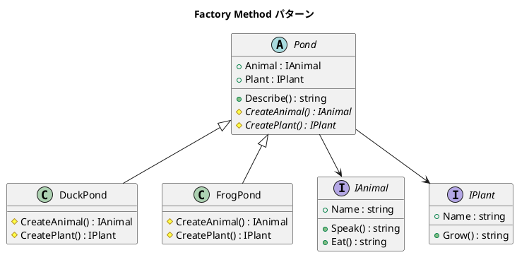
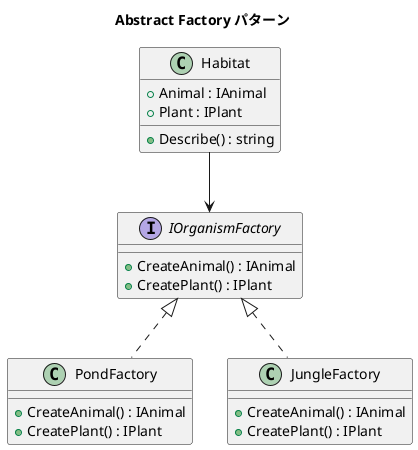

# 第 14 章: Factory

## はじめに

池（Pond）の生態系を作りたいとします。カエルの池にはカエルと藻、アヒルの池にはアヒルとスイレンが必要です。生成するオブジェクトの組み合わせをサブクラスに委ねるか、別のファクトリオブジェクトに委ねるかで、2 つのバリエーションがあります。

---

## パターンの構造

### Factory Method



### Abstract Factory



---

## TDD で作る

### Red: テストを書く

```csharp
[Fact]
public void DuckPond_CreatesDuckAndWaterLily()
{
    var pond = new DuckPond();

    Assert.IsType<Duck>(pond.Animal);
    Assert.IsType<WaterLily>(pond.Plant);
}

[Fact]
public void JungleFactory_CreatesTigerAndTree()
{
    var factory = new JungleFactory();
    var habitat = new Habitat(factory);

    Assert.IsType<Tiger>(habitat.Animal);
    Assert.IsType<Tree>(habitat.Plant);
}
```

### Green: 最小限の実装

```csharp
// Factory Method
public abstract class Pond
{
    public IAnimal Animal { get; }
    public IPlant Plant { get; }

    protected Pond()
    {
        Animal = CreateAnimal();
        Plant = CreatePlant();
    }

    protected abstract IAnimal CreateAnimal();
    protected abstract IPlant CreatePlant();
}

// Abstract Factory
public class Habitat
{
    public Habitat(IOrganismFactory factory)
    {
        Animal = factory.CreateAnimal();
        Plant = factory.CreatePlant();
    }
}
```

---

## Factory Method vs Abstract Factory

| 観点 | Factory Method | Abstract Factory |
|------|---------------|-----------------|
| 生成の主体 | サブクラス | 別のファクトリオブジェクト |
| 拡張方法 | 新しいサブクラスを追加 | 新しいファクトリを追加 |
| 結合度 | 継承による結合 | コンポジションによる結合 |

---

## まとめ

- Factory Method は**サブクラス**に生成を委ねる（継承ベース）
- Abstract Factory は**ファクトリオブジェクト**に生成を委ねる（コンポジションベース）
- C# ではインターフェースと抽象クラスで型安全なファクトリを実現
