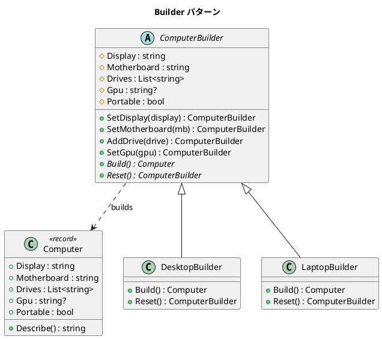

# 第 15 章: Builder

## はじめに

コンピュータの構成（ディスプレイ、マザーボード、ドライブ、GPU）を段階的に組み立てたいとします。デスクトップとラップトップでは構成が異なりますが、組み立てプロセスは共通です。

**Builder パターン**は、複雑なオブジェクトの構築プロセスを分離し、同じ構築過程で異なる表現を生成できるようにするパターンです。

---

## パターンの構造



---

## TDD で作る

### Red: テストを書く

```csharp
[Fact]
public void DesktopBuilder_BuildsDesktop()
{
    var computer = new DesktopBuilder()
        .SetDisplay("30-inch")
        .SetMotherboard("ATX")
        .AddDrive("SSD 1TB")
        .SetGpu("RTX 4090")
        .Build();

    Assert.False(computer.Portable);
    Assert.Equal("30-inch", computer.Display);
}

[Fact]
public void Builder_ResetsAfterBuild()
{
    var builder = new DesktopBuilder();
    builder.SetDisplay("30-inch").AddDrive("SSD").Build();

    var second = builder.SetDisplay("24-inch").Build();
    Assert.Equal("24-inch", second.Display);
    Assert.Empty(second.Drives);
}
```

### Green: 最小限の実装

```csharp
public record Computer(
    string Display,
    string Motherboard,
    List<string> Drives,
    string? Gpu = null,
    bool Portable = false
);
```

---

## C# ならではのポイント

### record 型でプロダクトを定義

```csharp
// record は不変の値オブジェクトを簡潔に定義
public record Computer(
    string Display,
    string Motherboard,
    List<string> Drives,
    string? Gpu = null,
    bool Portable = false
);

// ToString() が自動生成される
// 値の等価性が自動的に提供される（プリミティブフィールドのみ）
```

### Computer.Describe() メソッド

`Computer` record には構成情報を人間が読みやすい文字列で返す `Describe()` メソッドがあります。

```csharp
public string Describe()
{
    var drives = string.Join(", ", Drives);
    var gpu = Gpu != null ? $", GPU: {Gpu}" : "";
    var type = Portable ? "Laptop" : "Desktop";
    return $"{type} - Display: {Display}, Motherboard: {Motherboard}, Drives: [{drives}]{gpu}";
}
```

`Portable` フラグに基づいてタイプを「Laptop」または「Desktop」と表示し、GPU がある場合のみ GPU 情報を含めます。`record` の自動生成 `ToString()` とは異なり、フォーマットを制御できます。

### Fluent Builder パターン

```csharp
// メソッドチェインで直感的な構築
var computer = new DesktopBuilder()
    .SetDisplay("30-inch")
    .SetMotherboard("ATX")
    .AddDrive("SSD 1TB")
    .AddDrive("HDD 4TB")
    .SetGpu("RTX 4090")
    .Build();
```

---

## 他言語との比較

| 観点 | Ruby | Python | C# |
|------|------|--------|-----|
| プロダクト | Hash / OpenStruct | dataclass | `record` 型 |
| Fluent API | メソッドチェイン | メソッドチェイン | メソッドチェイン |
| Reset | 手動 | 手動 | `Reset()` メソッド |
| 不変性 | freeze | frozen=True | `record` (with) |

---

## まとめ

- Builder パターンは**複雑なオブジェクトの段階的な構築**を提供する
- C# の `record` 型でプロダクトを簡潔に定義できる
- Fluent Builder により、直感的なメソッドチェインで構築できる
- `Build()` 後に `Reset()` することで、同じ Builder インスタンスを再利用できる
