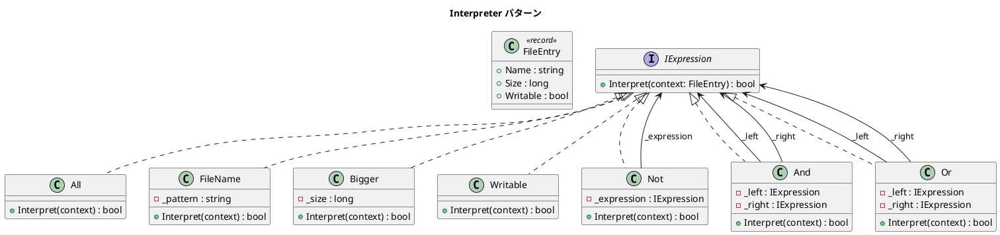

# 第 16 章: Interpreter

## はじめに

ファイル検索の条件を柔軟に組み合わせたいとします。「`.txt` ファイルで 1KB より大きいもの」や「書き込み可能で `.doc` または `.mp3` のもの」といった複合条件を表現したい場合、条件を木構造で表現する方法が有効です。

**Interpreter パターン**は、言語の文法を表現し、その文法に基づいて式を評価するパターンです。

---

## パターンの構造



---

## TDD で作る

### Red: テストを書く

```csharp
[Fact]
public void And_CombinesTwoExpressions()
{
    var expr = new And(new Bigger(1000), new FileName("*.doc"));

    Assert.True(expr.Interpret(new FileEntry("report.doc", 5000, true)));
    Assert.False(expr.Interpret(new FileEntry("song.mp3", 8000, true)));
}

[Fact]
public void Or_MatchesEitherExpression()
{
    var expr = new Or(new FileName("*.txt"), new FileName("*.mp3"));

    Assert.True(expr.Interpret(new FileEntry("notes.txt", 100, false)));
    Assert.True(expr.Interpret(new FileEntry("song.mp3", 8000, true)));
    Assert.False(expr.Interpret(new FileEntry("report.doc", 5000, true)));
}
```

### Green: 最小限の実装

```csharp
public record FileEntry(string Name, long Size, bool Writable);

public interface IExpression
{
    bool Interpret(FileEntry context);
}

public class And : IExpression
{
    private readonly IExpression _left;
    private readonly IExpression _right;

    public And(IExpression left, IExpression right)
    {
        _left = left;
        _right = right;
    }

    public bool Interpret(FileEntry context) =>
        _left.Interpret(context) && _right.Interpret(context);
}
```

### Refactor: 複合条件の構築

```csharp
// 大きな .doc ファイルで書き込み可能なもの
var expr = new And(
    new And(new Bigger(1000), new FileName("*.doc")),
    new Writable()
);

// .txt または .mp3 で 100バイト以下でないもの
var expr2 = new And(
    new Or(new FileName("*.txt"), new FileName("*.mp3")),
    new Not(new Bigger(100))
);
```

---

## C# ならではのポイント

### record 型でコンテキストを定義

```csharp
// record は不変の値オブジェクトとして最適
public record FileEntry(string Name, long Size, bool Writable);

// パターンマッチングでファイル名の拡張子を検査
private static bool MatchPattern(string name, string pattern)
{
    if (pattern == "*") return true;
    if (pattern.StartsWith("*."))
    {
        var extension = pattern[1..]; // Range 演算子
        return name.EndsWith(extension, StringComparison.OrdinalIgnoreCase);
    }
    return string.Equals(name, pattern, StringComparison.OrdinalIgnoreCase);
}
```

---

## 他言語との比較

| 観点 | Ruby | Python | C# |
|------|------|--------|-----|
| コンテキスト | Hash / OpenStruct | dataclass | `record` 型 |
| 式の評価 | `call` / `evaluate` | `interpret()` | `Interpret()` |
| 文字列比較 | `=~` / `File.fnmatch` | `fnmatch` | `EndsWith` / 手動 |
| 型安全性 | なし | 型ヒント | コンパイル時検証 |

---

## まとめ

- Interpreter パターンは**文法規則を木構造**で表現し、条件の組み合わせを柔軟に行う
- Terminal Expression（All, FileName, Bigger, Writable）と Non-terminal Expression（And, Or, Not）の組み合わせ
- C# の `record` 型でコンテキスト（FileEntry）を簡潔に定義
- Composite パターンとの類似性: 式ツリーも再帰的な木構造
