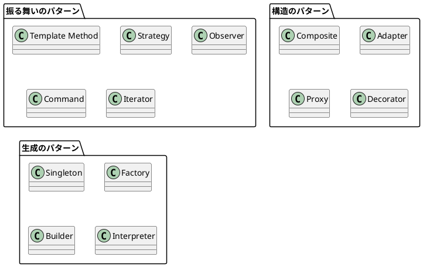

# 第 1 章 デザインパターンへの誘い

## はじめに

デザインパターンとは、ソフトウェア設計で繰り返し現れる問題に対する、再利用可能な解決策のカタログです。GoF (Gang of Four) が 1994 年に体系化した 23 のパターンは、オブジェクト指向プログラミングの文脈で定義されましたが、その本質は特定のパラダイムに依存しません。

## パターンとは何か

パターンは「問題」と「解決策」の対です。

- **問題**: 特定のコンテキストで繰り返し発生する設計上の課題
- **解決策**: その問題に対する構造的・振る舞い的なアプローチ

## パターンの分類

GoF のパターンは 3 つのカテゴリに分類されます。

## 関数型言語とパターン

Elixir のような関数型言語では、オブジェクト指向の「クラスの継承」や「インターフェースの実装」に頼らず、以下の手段でパターンを表現します。

- **高階関数**: 関数を引数や戻り値として扱う
- **パターンマッチング**: データの構造に基づく分岐
- **パイプライン**: `|>` 演算子による関数合成
- **Protocol**: 型に応じた振る舞いの多態性
- **タグ付きタプル**: 代数的データ型の表現

## なぜ Elixir でデザインパターンを学ぶのか

Elixir でデザインパターンを学ぶことで、パターンの「本質」が何であるかをより深く理解できます。クラスやインターフェースという道具立てが無い状態で同じ問題を解くことで、パターンが解決する問題の核心に迫ることができます。

## まとめ

- デザインパターンは問題と解決策の対である
- パターンの本質はパラダイムに依存しない
- Elixir の関数型アプローチでパターンを再解釈することで、より深い理解が得られる
