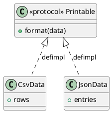

# 第 2 章 Elixir とパターンの世界

## Elixir の特徴

Elixir は Erlang VM (BEAM) 上で動作する動的型付けの関数型言語です。以下の特徴がデザインパターンの表現に深く関わります。

### 不変データ

Elixir のデータはすべて不変 (immutable) です。データを「変更」する操作は、実際には新しいデータを生成します。

```elixir
list = [1, 2, 3]
new_list = [0 | list]  # [0, 1, 2, 3] — 元の list は変わらない
```

### パターンマッチング

`=` は代入ではなくマッチング演算子です。関数の引数でもパターンマッチングが使えます。

```elixir
def describe({:circle, radius}), do: "Circle r=#{radius}"
def describe({:rect, w, h}), do: "Rectangle #{w}x#{h}"
```

### パイプライン演算子

`|>` 演算子でデータ変換を直線的に記述できます。

```elixir
"hello world"
|> String.upcase()
|> String.split(" ")
# => ["HELLO", "WORLD"]
```

### Protocol

Protocol は型に応じた振る舞いを定義する仕組みで、オブジェクト指向のインターフェースに相当します。



### 高階関数

関数を引数として渡したり、関数を返す関数を作れます。これが Strategy パターンや Template Method パターンの基盤です。

## OOP パターンから Elixir パターンへの変換

| OOP の概念 | Elixir の対応 |
|:---|:---|
| クラス継承 | 高階関数、Behaviour |
| インターフェース | Protocol |
| オブジェクトの状態 | マップ、構造体、プロセス |
| ポリモーフィズム | パターンマッチング、Protocol |
| デコレータ | パイプライン `\|>` |
| シングルトン | Application env、GenServer |

## まとめ

- Elixir は不変データ、パターンマッチング、高階関数を核とする関数型言語
- OOP のデザインパターンは Elixir の言語機能に自然に変換できる
- Protocol とパイプラインが構造と振る舞いのパターンの基盤となる
