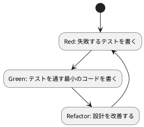

# 第 3 章 TDD で始めるパターン実装

## テスト駆動開発とは

テスト駆動開発 (TDD) は、コードを書く前にテストを書く開発手法です。Red-Green-Refactor の 3 ステップを繰り返します。



## ExUnit の基本

Elixir の標準テストフレームワーク ExUnit を使います。

```elixir
defmodule MyModuleTest do
  use ExUnit.Case

  test "足し算ができる" do
    assert 1 + 1 == 2
  end

  test "文字列を結合できる" do
    assert "hello" <> " " <> "world" == "hello world"
  end
end
```

### 主要なアサーション

| アサーション | 用途 |
|:---|:---|
| `assert` | 式が truthy であることを検証 |
| `refute` | 式が falsy であることを検証 |
| `assert_in_delta` | 浮動小数点の近似比較 |
| `assert_received` | プロセスメッセージの受信を検証 |
| `assert_raise` | 例外の発生を検証 |

## TDD でパターンを実装する流れ

### 1. Red: テストを書く

```elixir
test "昇順ソート戦略でソートする" do
  assert Strategy.sort([3, 1, 2], Strategy.ascending()) == [1, 2, 3]
end
```

### 2. Green: 最小の実装

```elixir
def sort(data, strategy), do: strategy.(data)
def ascending, do: &Enum.sort/1
```

### 3. Refactor: 設計を改善

ガード句やドキュメントを追加し、意図を明確にします。

```elixir
def sort(data, strategy) when is_function(strategy, 1) do
  strategy.(data)
end
```

## テストの実行

```bash
cd apps/elixir/design-pattern
mix test                    # 全テスト
mix test test/design_pattern/strategy_test.exs  # 個別テスト
```

## まとめ

- TDD は Red-Green-Refactor のサイクルを回す
- ExUnit は Elixir 標準のテストフレームワーク
- パターンの実装は小さなテストから始める
