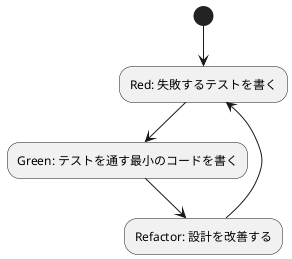

# 第 3 章 TDD で始めるパターン実装

## テスト駆動開発とは

テスト駆動開発 (TDD) は、コードを書く前にテストを書く開発手法です。Red-Green-Refactor の 3 ステップを繰り返します。



## ExUnit の基本

Elixir の標準テストフレームワーク ExUnit を使います。

```elixir
defmodule MyModuleTest do
  use ExUnit.Case

  test "足し算ができる" do
    assert 1 + 1 == 2
  end

  test "文字列を結合できる" do
    assert "hello" <> " " <> "world" == "hello world"
  end
end
```

### 主要なアサーション

| アサーション | 用途 |
|:---|:---|
| `assert` | 式が truthy であることを検証 |
| `refute` | 式が falsy であることを検証 |
| `assert_in_delta` | 浮動小数点の近似比較 |
| `assert_received` | プロセスメッセージの受信を検証 |
| `assert_raise` | 例外の発生を検証 |

## TDD でパターンを実装する流れ

### 1. Red: テストを書く

```elixir
test "昇順ソート戦略でソートする" do
  assert Strategy.sort([3, 1, 2], Strategy.ascending()) == [1, 2, 3]
end
```

### 2. Green: 最小の実装

```elixir
def sort(data, strategy), do: strategy.(data)
def ascending, do: &Enum.sort/1
```

### 3. Refactor: 設計を改善

ガード句やドキュメントを追加し、意図を明確にします。

```elixir
def sort(data, strategy) when is_function(strategy, 1) do
  strategy.(data)
end
```

## テストの実行

```bash
cd apps/elixir/design-pattern
mix test                    # 全テスト
mix test test/design_pattern/strategy_test.exs  # 個別テスト
```

---

## 静的コード解析: mix format + Credo

### mix format

`mix format` は Elixir 標準のコードフォーマッターです。`.formatter.exs` で設定し、プロジェクト全体のコードスタイルを統一します。

```bash
# フォーマットの実行
mix format

# フォーマット違反のチェック（CI 向け）
mix format --check-formatted
```

### Credo

Credo は Elixir の静的コード解析ツールです。コードの一貫性、可読性、リファクタリングの機会を検出します。

#### インストール

```elixir
# mix.exs の deps に追加
defp deps do
  [
    {:credo, "~> 1.7", only: [:dev, :test], runtime: false}
  ]
end
```

```bash
mix deps.get
mix credo gen.config  # .credo.exs を生成
```

#### Credo の実行

```bash
# 全チェック実行
mix credo

# 詳細な説明を表示
mix credo explain Credo.Check.Refactor.Nesting
```

### Credo の主要チェック

| カテゴリ | 説明 |
|---------|------|
| Consistency | コードの一貫性（スペース、括弧の使い方） |
| Readability | 可読性（モジュール名、関数名） |
| Refactor | リファクタリングの機会（ネスト、条件分岐） |
| Warning | 潜在的バグ（未使用変数、到達不能コード） |
| Design | 設計上の問題（関数の複雑度） |

---

## コード複雑度のチェック

Credo はコードの複雑度もチェックします。`Credo.Check.Refactor.CyclomaticComplexity` で循環的複雑度を測定し、`Credo.Check.Refactor.Nesting` でネストの深さを制限します。

| 指標 | デフォルト閾値 | 説明 |
|------|--------------|------|
| 循環的複雑度 | 9 | 分岐の数に基づく複雑さ |
| ネストの深さ | 2 | `if`/`case` のネスト制限 |
| 関数の長さ | - | Credo が警告を出す目安 |

---

## 品質チェックの一括実行

フォーマットチェック、静的解析、テストを一括で実行するコマンドです。

```bash
# フォーマットチェック + 静的解析 + テスト
mix format --check-formatted && mix credo && mix test
```

### 各言語の品質ツール比較

| 用途 | Elixir | Ruby | Java | TypeScript | Python |
|------|--------|------|------|-----------|--------|
| パッケージ管理 | Mix/Hex | Bundler | Gradle | npm | uv |
| テスト | ExUnit | minitest | JUnit 5 | Jest | pytest |
| 静的解析 | Credo | RuboCop | Checkstyle + PMD | ESLint | Ruff |
| フォーマッター | mix format | RuboCop | Checkstyle | Prettier | Ruff |
| カバレッジ | excoveralls | SimpleCov | JaCoCo | @vitest/coverage-v8 | pytest-cov |
| 複雑度チェック | Credo | RuboCop Metrics | PMD | ESLint complexity | Ruff McCabe |

---

## まとめ

- TDD は Red-Green-Refactor のサイクルを回す
- ExUnit は Elixir 標準のテストフレームワーク
- パターンの実装は小さなテストから始める
- `mix format` でコードスタイルを統一し、Credo で静的解析を行う
- `mix format --check-formatted && mix credo && mix test` で品質チェックを一括実行できる
