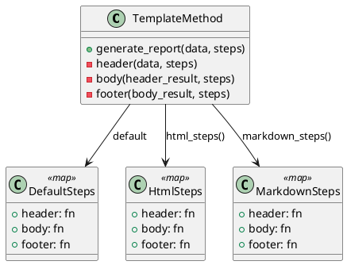

# 第 4 章 高階関数でアルゴリズムの骨格を定める — Template Method

## パターンの目的

Template Method パターンは、アルゴリズムの骨格を定義し、一部のステップをサブクラスに委ねるパターンです。Elixir では高階関数と関数マップで同じことを実現します。

## 構造



## 実装

テンプレートメソッドは `generate_report/2` 関数で、各ステップを関数マップから取得します。

```elixir
def generate_report(data, steps \\\\ %{}) do
  data
  |> header(steps)
  |> body(steps)
  |> footer(steps)
end
```

ステップマップを差し替えることで、出力形式を変更できます。

```elixir
# HTML 形式
TemplateMethod.generate_report(data, TemplateMethod.html_steps())

# Markdown 形式
TemplateMethod.generate_report(data, TemplateMethod.markdown_steps())
```

## テスト

```elixir
test "デフォルトのテンプレートでレポートを生成する" do
  result = TemplateMethod.generate_report(["Alice", "Bob"])
  assert result == "=== Report ===\\nAlice, Bob\\n=== End ==="
end

test "HTML 形式のテンプレートでレポートを生成する" do
  result = TemplateMethod.generate_report(["Alice", "Bob"], TemplateMethod.html_steps())
  assert result =~ "<html>"
  assert result =~ "<li>Alice</li>"
end
```

## Elixir らしさ

- クラス継承の代わりに関数マップで差し替え
- `Map.get/3` のデフォルト値で未指定のステップにフォールバック
- 部分的なカスタマイズが可能（一部のステップだけ差し替え）

## まとめ

- Template Method は高階関数と関数マップで自然に表現できる
- 継承の代わりにデータ（マップ）で振る舞いを差し替える
- 部分的なカスタマイズが容易
