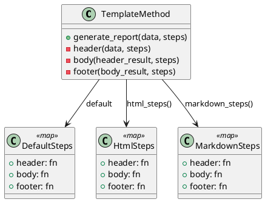

# 第 4 章 高階関数でアルゴリズムの骨格を定める — Template Method

## はじめに

Template Method パターンは、アルゴリズムの骨格を定義し、一部のステップをサブクラスに委ねるパターンです。Elixir では高階関数と関数マップで同じことを実現します。

## パターンの構造



## Elixir イディオム: 高階関数と関数マップ

テンプレートメソッドは `generate_report/2` 関数で、各ステップを関数マップから取得します。

```elixir
def generate_report(data, steps \\\\ %{}) do
  data
  |> header(steps)
  |> body(steps)
  |> footer(steps)
end
```

ステップマップを差し替えることで、出力形式を変更できます。

```elixir
# HTML 形式
TemplateMethod.generate_report(data, TemplateMethod.html_steps())

# Markdown 形式
TemplateMethod.generate_report(data, TemplateMethod.markdown_steps())
```

## TDD で作る

### Red: 失敗するテストを書く

```elixir
test "デフォルトのテンプレートでレポートを生成する" do
  result = TemplateMethod.generate_report(["Alice", "Bob"])
  assert result == "=== Report ===\\nAlice, Bob\\n=== End ==="
end

test "HTML 形式のテンプレートでレポートを生成する" do
  result = TemplateMethod.generate_report(["Alice", "Bob"], TemplateMethod.html_steps())
  assert result =~ "<html>"
  assert result =~ "<li>Alice</li>"
end
```

### Green: 最小限の実装

`generate_report/2` を先に通し、`header`、`body`、`footer` の各ステップはデフォルト関数や差し替えマップへ委譲します。最初はデフォルトテンプレートだけを通し、HTML 形式は後から足して十分です。

### Refactor

ステップ関数をマップに閉じ込めておくと、一部だけ差し替えるテンプレートやフォーマット追加がしやすくなります。

## Map.get/3 によるステップフォールバック

各ステップの取得には `Map.get/3` の第 3 引数にデフォルト関数の参照を渡しています。ステップマップにキーが含まれていなければデフォルト実装が使われます。

```elixir
defp header(data, steps) do
  header_fn = Map.get(steps, :header, &default_header/1)
  header_fn.(data)
end
```

`&default_header/1` はモジュール内のプライベート関数への参照です。`Map.get/3` はマップにキー `:header` が存在すればその値（ユーザー指定の関数）を、存在しなければ第 3 引数のデフォルト関数を返します。これにより、ステップマップを部分的に渡すだけで一部のステップだけを差し替えられます。

## 部分的なカスタマイズ

ステップマップに全キーを含める必要はありません。指定したステップだけが差し替わり、残りはデフォルト実装が使われます。

```elixir
# footer だけをカスタマイズ（header と body はデフォルトのまま）
custom_footer_only = %{
  footer: fn -> "--- Custom Footer ---" end
}

result = TemplateMethod.generate_report(["Alice", "Bob"], custom_footer_only)
# => "=== Report ===\nAlice, Bob\n--- Custom Footer ---"
```

この設計により、すべてのステップを再定義しなくても、必要な部分だけを柔軟にカスタマイズできます。

## Elixir らしさ

- クラス継承の代わりに関数マップで差し替え
- `Map.get/3` のデフォルト値で未指定のステップにフォールバック
- 部分的なカスタマイズが可能（一部のステップだけ差し替え）

## まとめ

- Template Method は高階関数と関数マップで自然に表現できる
- 継承の代わりにデータ（マップ）で振る舞いを差し替える
- 部分的なカスタマイズが容易
