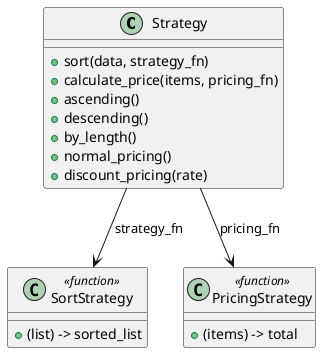

# 第 5 章 関数を渡してアルゴリズムを切り替える — Strategy

## はじめに

Strategy パターンは、アルゴリズムをカプセル化し、実行時に切り替え可能にするパターンです。Elixir では関数が第一級オブジェクトであるため、関数を引数として渡すだけで実現できます。

## パターンの構造



## Elixir イディオム: 関数そのものを戦略として渡す

Strategy はシンプルに関数を引数として受け取ります。

```elixir
def sort(data, strategy) when is_function(strategy, 1) do
  strategy.(data)
end

def ascending, do: &Enum.sort(&1)
def descending, do: &Enum.sort(&1, :desc)
```

## TDD で作る

### Red: 失敗するテストを書く

```elixir
test "昇順ソート戦略でソートする" do
  assert Strategy.sort([3, 1, 2], Strategy.ascending()) == [1, 2, 3]
end

test "カスタム戦略を関数で渡せる" do
  reverse = fn list -> Enum.reverse(list) end
  assert Strategy.sort([1, 2, 3], reverse) == [3, 2, 1]
end
```

### Green: 最小限の実装

`sort/2` が受け取った関数をそのまま呼び出すところから始めれば十分です。昇順や降順の戦略は `&Enum.sort/1` のような関数としてあとから増やせます。

### Refactor

単純な戦略はキャプチャ構文 `&`、パラメタ付きの戦略はクロージャで表現すると、使い分けがはっきりします。

## クロージャによるパラメタライズド戦略

`discount_pricing/1` は割引率を受け取り、その率を閉じ込めたクロージャ（関数）を返します。戦略そのものをパラメータで生成するパターンです。

```elixir
def discount_pricing(rate) do
  fn items -> Enum.sum(items) * (1 - rate) end
end
```

`rate` はクロージャの中に閉じ込められるため、返された関数は `rate` を記憶しています。これにより、異なる割引率の戦略を動的に生成できます。

```elixir
# 10% 割引戦略を生成
ten_percent_off = Strategy.discount_pricing(0.1)
Strategy.calculate_price([1000, 2000, 3000], ten_percent_off)
# => 5400.0

# 30% 割引戦略を生成
thirty_percent_off = Strategy.discount_pricing(0.3)
Strategy.calculate_price([1000, 2000, 3000], thirty_percent_off)
# => 4200.0

# 通常価格戦略
Strategy.calculate_price([1000, 2000, 3000], Strategy.normal_pricing())
# => 6000
```

このパターンは、クロージャが「設定を持つ関数」として働く点が特徴です。OOP では Strategy インターフェースの実装クラスにフィールドを持たせますが、Elixir ではクロージャが同じ役割を果たします。

## Elixir らしさ

- 関数が第一級オブジェクトなので、Strategy パターンは言語に組み込まれている
- 無名関数やキャプチャ構文 `&` で戦略を簡潔に定義
- クロージャで状態を持つ戦略も作れる（例: 割引率）

## まとめ

- Elixir では関数がそのまま Strategy となる
- インターフェースの定義は不要で、関数の引数の数だけが契約
- クロージャでパラメタライズされた戦略を作成できる
