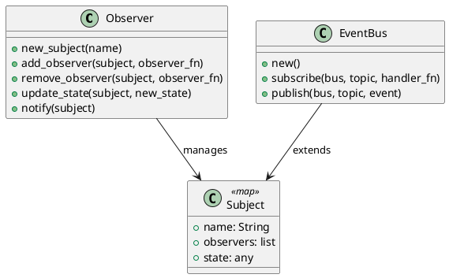

# 第 6 章 コールバックで変化を通知する — Observer

## はじめに

Observer パターンは、あるオブジェクトの状態変化を、依存するオブジェクトに自動的に通知するパターンです。Elixir ではコールバック関数のリストと不変マップで実現します。

## パターンの構造



## Elixir イディオム: コールバック関数のリスト

サブジェクトはマップで表現し、オブザーバーは関数のリストとして保持します。

```elixir
def update_state(subject, new_state) do
  updated = %{subject | state: new_state}
  notify(updated)
  updated
end

def notify(subject) do
  Enum.each(subject.observers, fn observer ->
    observer.(subject.name, subject.state)
  end)
end
```

## TDD で作る

### Red: 失敗するテストを書く

```elixir
test "オブザーバーに通知が届く" do
  test_pid = self()
  observer = fn name, state ->
    send(test_pid, {:notified, name, state})
  end

  Observer.new_subject("sensor")
  |> Observer.add_observer(observer)
  |> Observer.update_state(100)

  assert_received {:notified, "sensor", 100}
end
```

### Green: 最小限の実装

`update_state/2` で新しい状態を持つサブジェクトを作り、`notify/1` で登録済みコールバックを順に呼べばテストを通せます。まずは 1 つの通知経路だけを通すのが先です。

### Refactor

単純なオブザーバー配列で仕組みを確認した後、トピック単位の分配が必要になったら `EventBus` へ発展させます。

## オブザーバーの削除と状態取得

`remove_observer/2` で登録済みオブザーバーを削除できます。`List.delete/2` で参照が一致するオブザーバーを除去します。

```elixir
observer = fn name, state -> IO.puts("#{name}: #{state}") end

subject =
  Observer.new_subject("sensor")
  |> Observer.add_observer(observer)

# オブザーバーを削除
subject = Observer.remove_observer(subject, observer)
```

`get_state/1` でサブジェクトの現在の状態を取得できます。

```elixir
subject =
  Observer.new_subject("sensor")
  |> Observer.update_state(42)

Observer.get_state(subject)
# => 42
```

## EventBus への発展

`EventBus` はトピックベースのイベント分配を行うモジュールです。トピックごとにハンドラのリストを管理します。

```elixir
alias DesignPattern.Observer.EventBus

# 空のイベントバスを作成
bus = EventBus.new()
# => %{}

# トピックにハンドラを登録（ハンドラはアリティ 1 の関数）
bus =
  bus
  |> EventBus.subscribe(:user_created, fn event ->
    IO.puts("User created: #{inspect(event)}")
  end)
  |> EventBus.subscribe(:user_created, fn event ->
    IO.puts("Send welcome email to #{event.name}")
  end)
  |> EventBus.subscribe(:order_placed, fn event ->
    IO.puts("Order placed: #{event.id}")
  end)

# トピックにイベントを発行（全ハンドラが呼ばれる）
EventBus.publish(bus, :user_created, %{name: "Alice", id: 1})
# => "User created: %{name: \"Alice\", id: 1}"
# => "Send welcome email to Alice"
```

`EventBus` は `Observer` と異なり、ハンドラがアリティ 1（イベントデータのみ受け取る）で、トピックでイベントを振り分けます。

## Observer vs EventBus vs GenServer の使い分け

| 方式 | 用途 | 状態管理 | 並行性 |
|------|------|----------|--------|
| Observer | シンプルな 1 対多の通知 | 不変マップ（呼び出し側で管理） | なし（同一プロセス内） |
| EventBus | トピックベースの多対多の通知 | 不変マップ（呼び出し側で管理） | なし（同一プロセス内） |
| GenServer | 並行環境での状態管理と通知 | プロセス内部で管理 | あり（プロセス間メッセージ） |

- 単純なコールバック通知なら `Observer` で十分です
- トピックでイベントを分類したい場合は `EventBus` を使います
- 並行プロセス間で通知を行う場合は GenServer や `Phoenix.PubSub` を検討してください

## まとめ

- Observer はコールバック関数のリストで実現する
- `send/2` と `assert_received` でテストが容易
- `remove_observer/2` でオブザーバーの動的な削除が可能
- EventBus でトピックベースの通知に発展可能
- 並行環境では GenServer の利用を検討する
