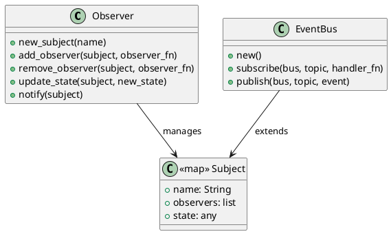

# 第 6 章 コールバックで変化を通知する — Observer

## パターンの目的

Observer パターンは、あるオブジェクトの状態変化を、依存するオブジェクトに自動的に通知するパターンです。Elixir ではコールバック関数のリストと不変マップで実現します。

## 構造



## 実装

サブジェクトはマップで表現し、オブザーバーは関数のリストとして保持します。

```elixir
def update_state(subject, new_state) do
  updated = %{subject | state: new_state}
  notify(updated)
  updated
end

def notify(subject) do
  Enum.each(subject.observers, fn observer ->
    observer.(subject.name, subject.state)
  end)
end
```

## テスト

```elixir
test "オブザーバーに通知が届く" do
  test_pid = self()
  observer = fn name, state ->
    send(test_pid, {:notified, name, state})
  end

  Observer.new_subject("sensor")
  |> Observer.add_observer(observer)
  |> Observer.update_state(100)

  assert_received {:notified, "sensor", 100}
end
```

## EventBus への発展

トピックベースのイベントバスで、より柔軟な通知を実現します。

```elixir
bus = EventBus.new()
|> EventBus.subscribe(:user_created, fn e -> handle(e) end)
EventBus.publish(bus, :user_created, %{id: 1})
```

## まとめ

- Observer はコールバック関数のリストで実現する
- `send/2` と `assert_received` でテストが容易
- EventBus でトピックベースの通知に発展可能
