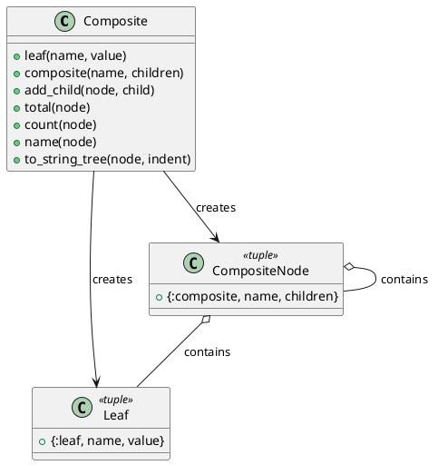

# 第 7 章 再帰で木構造を統一的に扱う — Composite

## はじめに

Composite パターンは、個々のオブジェクトとオブジェクトの集合を同一視して扱うパターンです。Elixir ではタグ付きタプルと再帰的パターンマッチングで木構造を表現します。

## パターンの構造



## Elixir イディオム: タグ付きタプルと再帰

タグ付きタプルの先頭要素でリーフとコンポジットを区別します。

```elixir
def total({:leaf, _name, value}), do: value
def total({:composite, _name, children}) do
  Enum.reduce(children, 0, fn child, acc -> acc + total(child) end)
end
```

## TDD で作る

### Red: 失敗するテストを書く

```elixir
test "ネストしたコンポジットの合計を再帰的に計算する" do
  subtree =
    Composite.composite("sub")
    |> Composite.add_child(Composite.leaf("x", 5))
    |> Composite.add_child(Composite.leaf("y", 15))

  tree =
    Composite.composite("root")
    |> Composite.add_child(subtree)
    |> Composite.add_child(Composite.leaf("z", 30))

  assert Composite.total(tree) == 50
end
```

### Green: 最小限の実装

まずは `{:leaf, ...}` と `{:composite, ...}` の 2 形だけを定義し、`total/1` を再帰で通します。葉と枝の分岐はパターンマッチングだけで十分です。

### Refactor

`count/1` や `to_string_tree/2` も同じ再帰骨格で書けるため、木構造に対する操作を統一しやすくなります。

## Elixir らしさ

- タグ付きタプルが代数的データ型の役割を果たす
- パターンマッチングでリーフとコンポジットを自然に分岐
- `Enum.reduce/3` で子ノードを再帰的に集約

## まとめ

- Composite はタグ付きタプルと再帰で表現する
- パターンマッチングがリーフ/コンポジットの区別を担う
- 再帰関数で木構造全体を走査・集約する
