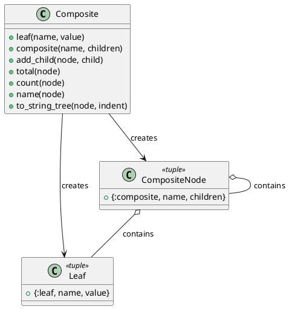

# 第 7 章 再帰で木構造を統一的に扱う — Composite

## はじめに

Composite パターンは、個々のオブジェクトとオブジェクトの集合を同一視して扱うパターンです。Elixir ではタグ付きタプルと再帰的パターンマッチングで木構造を表現します。

## パターンの構造



## Elixir イディオム: タグ付きタプルと再帰

タグ付きタプルの先頭要素でリーフとコンポジットを区別します。

```elixir
def total({:leaf, _name, value}), do: value
def total({:composite, _name, children}) do
  Enum.reduce(children, 0, fn child, acc -> acc + total(child) end)
end
```

## TDD で作る

### Red: 失敗するテストを書く

```elixir
test "ネストしたコンポジットの合計を再帰的に計算する" do
  subtree =
    Composite.composite("sub")
    |> Composite.add_child(Composite.leaf("x", 5))
    |> Composite.add_child(Composite.leaf("y", 15))

  tree =
    Composite.composite("root")
    |> Composite.add_child(subtree)
    |> Composite.add_child(Composite.leaf("z", 30))

  assert Composite.total(tree) == 50
end
```

### Green: 最小限の実装

まずは `{:leaf, ...}` と `{:composite, ...}` の 2 形だけを定義し、`total/1` を再帰で通します。葉と枝の分岐はパターンマッチングだけで十分です。

### Refactor

`count/1` や `to_string_tree/2` も同じ再帰骨格で書けるため、木構造に対する操作を統一しやすくなります。

## 子ノードの追加とカウント

`add_child/2` はコンポジットノードに子を追加します。パターンマッチングで `:composite` タグを確認し、`children` リストに追加します。

```elixir
tree =
  Composite.composite("root")
  |> Composite.add_child(Composite.leaf("a", 10))
  |> Composite.add_child(Composite.leaf("b", 20))
```

`count/1` はノード数を再帰的にカウントします。リーフは 1、コンポジットは自身（1）に子ノードのカウントを加算します。

```elixir
def count({:leaf, _name, _value}), do: 1

def count({:composite, _name, children}) do
  Enum.reduce(children, 1, fn child, acc -> acc + count(child) end)
end

Composite.count(tree)
# => 3（root + a + b）
```

## 木構造の文字列表現

`to_string_tree/2` は木構造をインデント付きの文字列に変換します。第 2 引数 `indent` でネストの深さを管理します。

```elixir
subtree =
  Composite.composite("department")
  |> Composite.add_child(Composite.leaf("Alice", 50000))
  |> Composite.add_child(Composite.leaf("Bob", 60000))

tree =
  Composite.composite("company")
  |> Composite.add_child(subtree)
  |> Composite.add_child(Composite.leaf("Charlie", 70000))

IO.puts(Composite.to_string_tree(tree))
# + company
#   + department
#     Alice: 50000
#     Bob: 60000
#   Charlie: 70000
```

コンポジットノードは `+ ` プレフィックスで表示され、リーフノードは `name: value` の形式で表示されます。子ノードは親よりも 1 段深いインデントで表示されます。

## Elixir らしさ

- タグ付きタプルが代数的データ型の役割を果たす
- パターンマッチングでリーフとコンポジットを自然に分岐
- `Enum.reduce/3` で子ノードを再帰的に集約

## まとめ

- Composite はタグ付きタプルと再帰で表現する
- パターンマッチングがリーフ/コンポジットの区別を担う
- `add_child/2` で木構造を段階的に構築する
- `count/1` と `to_string_tree/2` で木構造を再帰的に走査・表示する
