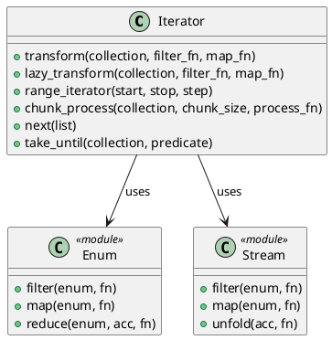

# 第 8 章 Enum と Stream で走査する — Iterator

## はじめに

Iterator パターンは、コレクションの内部構造を公開せずに要素へ順次アクセスする方法を提供するパターンです。Elixir では `Enum` と `Stream` モジュールが Iterator パターンそのものです。

## パターンの構造



## Elixir イディオム: Enum と Stream の使い分け

即時評価と遅延評価の 2 つのアプローチを使い分けます。

```elixir
# 即時評価
def transform(collection, filter_fn, map_fn) do
  collection
  |> Enum.filter(filter_fn)
  |> Enum.map(map_fn)
end

# 遅延評価
def lazy_transform(collection, filter_fn, map_fn) do
  collection
  |> Stream.filter(filter_fn)
  |> Stream.map(map_fn)
end
```

`Stream.unfold/2` でカスタムイテレータを作成できます。

```elixir
def range_iterator(start, stop, step \\\\ 1) do
  Stream.unfold(start, fn
    current when current > stop -> nil
    current -> {current, current + step}
  end)
end
```

## TDD で作る

### Red: 失敗するテストを書く

```elixir
test "遅延評価で変換する" do
  result =
    Iterator.lazy_transform(1..100, &(rem(&1, 3) == 0), &(&1 * 2))
    |> Enum.take(3)
  assert result == [6, 12, 18]
end
```

### Green: 最小限の実装

最初は `Enum.filter/2` と `Enum.map/2` を組み合わせた即時評価版を作り、その後に同じ構造で `Stream` 版へ置き換えると意図が見えやすくなります。

### Refactor

即時評価と遅延評価を別関数に分けると、処理量やメモリ効率の違いをコード上で比較しやすくなります。

## まとめ

- Elixir の `Enum`/`Stream` が Iterator パターンの完全な実装
- `Stream` で遅延評価を実現し、大きなコレクションを効率的に処理
- `Stream.unfold/2` でカスタムイテレータを作成可能
