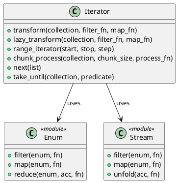

# 第 8 章 Enum と Stream で走査する — Iterator

## はじめに

Iterator パターンは、コレクションの内部構造を公開せずに要素へ順次アクセスする方法を提供するパターンです。Elixir では `Enum` と `Stream` モジュールが Iterator パターンそのものです。

## パターンの構造



## Elixir イディオム: Enum と Stream の使い分け

即時評価と遅延評価の 2 つのアプローチを使い分けます。

```elixir
# 即時評価
def transform(collection, filter_fn, map_fn) do
  collection
  |> Enum.filter(filter_fn)
  |> Enum.map(map_fn)
end

# 遅延評価
def lazy_transform(collection, filter_fn, map_fn) do
  collection
  |> Stream.filter(filter_fn)
  |> Stream.map(map_fn)
end
```

`Stream.unfold/2` でカスタムイテレータを作成できます。

```elixir
def range_iterator(start, stop, step \\\\ 1) do
  Stream.unfold(start, fn
    current when current > stop -> nil
    current -> {current, current + step}
  end)
end
```

## TDD で作る

### Red: 失敗するテストを書く

```elixir
test "遅延評価で変換する" do
  result =
    Iterator.lazy_transform(1..100, &(rem(&1, 3) == 0), &(&1 * 2))
    |> Enum.take(3)
  assert result == [6, 12, 18]
end
```

### Green: 最小限の実装

最初は `Enum.filter/2` と `Enum.map/2` を組み合わせた即時評価版を作り、その後に同じ構造で `Stream` 版へ置き換えると意図が見えやすくなります。

### Refactor

即時評価と遅延評価を別関数に分けると、処理量やメモリ効率の違いをコード上で比較しやすくなります。

## その他のイテレーション関数

### チャンクごとの処理

`chunk_process/3` はコレクションを指定サイズのチャンクに分割し、各チャンクに処理関数を適用します。

```elixir
Iterator.chunk_process(1..10, 3, &Enum.sum/1)
# => [6, 15, 24, 10]
# [1,2,3] -> 6, [4,5,6] -> 15, [7,8,9] -> 24, [10] -> 10
```

### 外部イテレータ

`next/1` はリストの先頭要素を取り出し、残りのリストとともに返します。外部イテレータ（呼び出し側がイテレーションを制御するパターン）のシミュレーションです。

```elixir
{:ok, head, tail} = Iterator.next([1, 2, 3])
# head => 1, tail => [2, 3]

{:ok, head, tail} = Iterator.next(tail)
# head => 2, tail => [3]

{:done, []} = Iterator.next([])
```

### 条件付きイテレーション

`take_until/2` は条件が真になるまでの要素を取得します（条件が真になった要素は含まれません）。

```elixir
Iterator.take_until([1, 2, 3, 10, 4, 5], fn x -> x >= 10 end)
# => [1, 2, 3]
```

## Enum vs Stream vs next/1 の比較

| 方式 | 評価 | メモリ使用 | 制御の主体 | 用途 |
|------|------|------------|------------|------|
| `Enum` | 即時（eager） | コレクション全体 | ライブラリ側 | 小〜中サイズのコレクション |
| `Stream` | 遅延（lazy） | 要素ごと | ライブラリ側 | 大きなコレクション、無限列 |
| `next/1` | 手動 | 要素ごと | 呼び出し側 | 外部制御が必要な場合 |

通常は `Enum` で十分です。コレクションが大きい場合やパイプラインの中間結果を抑えたい場合は `Stream` を使います。イテレーションの制御を呼び出し側で行いたい特殊なケースでは `next/1` パターンを検討してください。

## まとめ

- Elixir の `Enum`/`Stream` が Iterator パターンの完全な実装
- `Stream` で遅延評価を実現し、大きなコレクションを効率的に処理
- `Stream.unfold/2` でカスタムイテレータを作成可能
- `chunk_process/3` でバッチ処理、`next/1` で外部イテレータを実現
