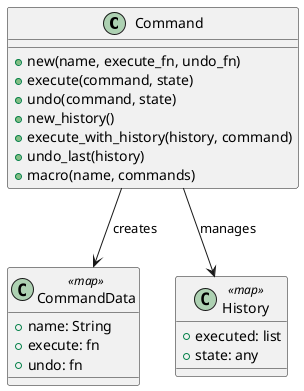

# 第 9 章 操作をデータとして扱う — Command

## はじめに

Command パターンは、操作をオブジェクトとしてカプセル化し、実行・取り消し・キューイングを可能にするパターンです。Elixir では操作をマップとして表現し、`:execute` と `:undo` に関数を持たせます。

## パターンの構造



## Elixir イディオム: 関数を持つコマンドマップ

コマンドは `:execute` と `:undo` の関数を持つマップです。

```elixir
def new(name, execute_fn, undo_fn) do
  %{name: name, execute: execute_fn, undo: undo_fn}
end

def execute(command, state), do: command.execute.(state)
def undo(command, state), do: command.undo.(state)
```

マクロコマンドで複数の操作を一括実行できます。

```elixir
def macro(name, commands) do
  %{
    name: name,
    execute: fn state ->
      Enum.reduce(commands, state, fn cmd, acc -> cmd.execute.(acc) end)
    end,
    undo: fn state ->
      Enum.reduce(Enum.reverse(commands), state, fn cmd, acc -> cmd.undo.(acc) end)
    end
  }
end
```

## TDD で作る

### Red: 失敗するテストを書く

```elixir
test "マクロコマンドで複数操作を一括実行する" do
  cmd1 = Command.new("a", fn n -> n + 1 end, fn n -> n - 1 end)
  cmd2 = Command.new("b", fn n -> n * 3 end, fn n -> div(n, 3) end)
  macro = Command.macro("macro", [cmd1, cmd2])

  assert Command.execute(macro, 2) == 9
  assert Command.undo(macro, 9) == 2
end
```

### Green: 最小限の実装

まずは `new/3`、`execute/2`、`undo/2` だけを持つ最小のコマンドマップを通します。複合操作や履歴管理は、そのあとに載せれば十分です。

### Refactor

マクロコマンドや履歴を別関数へ分けると、単一コマンドの責務と実行管理の責務を分離できます。

## 履歴管理

`new_history/0`、`execute_with_history/2`、`undo_last/1` でコマンドの実行履歴を管理し、undo を実現します。

```elixir
cmd_add = Command.new("add 10", fn n -> n + 10 end, fn n -> n - 10 end)
cmd_mul = Command.new("mul 3", fn n -> n * 3 end, fn n -> div(n, 3) end)

history =
  Command.new_history()                        # %{executed: [], state: nil}
  |> Map.put(:state, 0)                        # 初期状態を設定
  |> Command.execute_with_history(cmd_add)     # state: 10, executed: [cmd_add]
  |> Command.execute_with_history(cmd_mul)     # state: 30, executed: [cmd_mul, cmd_add]

history.state
# => 30

# 最後のコマンドを取り消す
history = Command.undo_last(history)
history.state
# => 10

# さらに取り消す
history = Command.undo_last(history)
history.state
# => 0

# 履歴が空の場合は何もしない
history = Command.undo_last(history)
history.state
# => 0
```

履歴はスタック構造（リストの先頭に追加）で管理されています。`undo_last/1` は履歴が空の場合はそのまま返すため、安全に呼び出せます。

## マクロコマンド

`macro/2` は複数のコマンドを 1 つのコマンドにまとめます。実行時は順番に、undo 時は逆順に処理します。

```elixir
cmd1 = Command.new("add 1", fn n -> n + 1 end, fn n -> n - 1 end)
cmd2 = Command.new("mul 3", fn n -> n * 3 end, fn n -> div(n, 3) end)
macro = Command.macro("add_and_mul", [cmd1, cmd2])

Command.execute(macro, 2)
# => 9  (2 + 1 = 3, 3 * 3 = 9)

Command.undo(macro, 9)
# => 2  (9 / 3 = 3, 3 - 1 = 2)  ※逆順で undo
```

## まとめ

- Command はマップと関数で操作をデータ化する
- `new_history/0` と `execute_with_history/2` で実行履歴を管理できる
- `undo_last/1` で最後のコマンドを安全に取り消せる
- `macro/2` で複数コマンドを合成し、一括実行・一括 undo が可能
