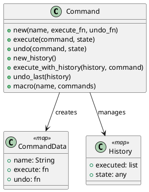

# 第 9 章 操作をデータとして扱う — Command

## パターンの目的

Command パターンは、操作をオブジェクトとしてカプセル化し、実行・取り消し・キューイングを可能にするパターンです。Elixir では操作をマップとして表現し、`:execute` と `:undo` に関数を持たせます。

## 構造



## 実装

コマンドは `:execute` と `:undo` の関数を持つマップです。

```elixir
def new(name, execute_fn, undo_fn) do
  %{name: name, execute: execute_fn, undo: undo_fn}
end

def execute(command, state), do: command.execute.(state)
def undo(command, state), do: command.undo.(state)
```

マクロコマンドで複数の操作を一括実行できます。

```elixir
def macro(name, commands) do
  %{
    name: name,
    execute: fn state ->
      Enum.reduce(commands, state, fn cmd, acc -> cmd.execute.(acc) end)
    end,
    undo: fn state ->
      Enum.reduce(Enum.reverse(commands), state, fn cmd, acc -> cmd.undo.(acc) end)
    end
  }
end
```

## テスト

```elixir
test "マクロコマンドで複数操作を一括実行する" do
  cmd1 = Command.new("a", fn n -> n + 1 end, fn n -> n - 1 end)
  cmd2 = Command.new("b", fn n -> n * 3 end, fn n -> div(n, 3) end)
  macro = Command.macro("macro", [cmd1, cmd2])

  assert Command.execute(macro, 2) == 9
  assert Command.undo(macro, 9) == 2
end
```

## まとめ

- Command はマップと関数で操作をデータ化する
- 履歴管理により undo が容易に実装できる
- マクロコマンドで複数操作を合成できる
