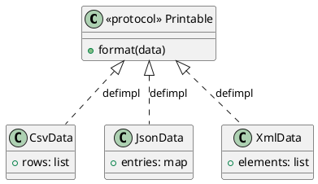

# 第 10 章 Protocol でインターフェースを合わせる — Adapter

## パターンの目的

Adapter パターンは、互換性のないインターフェースを持つ既存のクラスを、期待されるインターフェースに適合させるパターンです。Elixir では Protocol と `defimpl` で実現します。

## 構造



## 実装

Protocol で共通インターフェースを定義し、各データ型に `defimpl` で実装します。

```elixir
defprotocol DesignPattern.Adapter.Printable do
  def format(data)
end

defimpl DesignPattern.Adapter.Printable, for: DesignPattern.Adapter.CsvData do
  def format(%{rows: rows}) do
    Enum.map_join(rows, "\\n", fn row -> Enum.join(row, ",") end)
  end
end
```

## テスト

```elixir
test "異なる型で同じプロトコルが使える" do
  data_list = [
    %CsvData{rows: [["a"]]},
    %JsonData{entries: %{a: 1}},
    %XmlData{elements: [{:a, 1}]}
  ]
  results = Enum.map(data_list, &Printable.format/1)
  assert length(results) == 3
  assert Enum.all?(results, &is_binary/1)
end
```

## Elixir らしさ

- Protocol は既存の型に対して後から実装を追加できる（オープン拡張）
- 構造体ごとに独立して `defimpl` を定義
- `for: Any` でデフォルト実装を提供可能

## まとめ

- Adapter は Protocol と defimpl で自然に表現される
- 既存の型に後から適合させることが可能（オープン拡張）
- 型安全なポリモーフィズムを実現する
