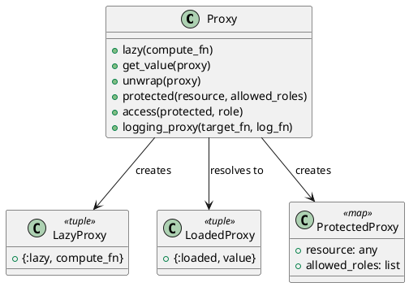

# 第 11 章 遅延評価とアクセス制御で間接化する — Proxy

## はじめに

Proxy パターンは、他のオブジェクトへのアクセスを制御するための代理を提供するパターンです。Elixir では遅延評価（関数のラップ）とパターンマッチングによるアクセス制御で実現します。

## パターンの構造



## Elixir イディオム: タグ付きタプルと関数ラップ

### 遅延ロードプロキシ

```elixir
def lazy(compute_fn), do: {:lazy, compute_fn}

def get_value({:lazy, compute_fn}) do
  value = compute_fn.()
  {:loaded, value}
end

def get_value({:loaded, value}), do: {:loaded, value}
```

### アクセス制御プロキシ

```elixir
def access(%{allowed_roles: allowed_roles, resource: resource}, role) do
  if role in allowed_roles do
    {:ok, resource}
  else
    {:error, :access_denied}
  end
end
```

## TDD で作る

### Red: 失敗するテストを書く

```elixir
test "アクセス制御プロキシで拒否されたロールはアクセスできない" do
  resource = Proxy.protected("secret data", [:admin])
  assert {:error, :access_denied} = Proxy.access(resource, :guest)
end
```

### Green: 最小限の実装

まずはアクセス制御プロキシだけを通し、許可されたロールなら `{:ok, resource}`、それ以外は `{:error, :access_denied}` を返す形にします。遅延ロードはその後に足せます。

### Refactor

遅延ロード、保護、ロギングは目的が異なるので、プロキシ生成関数を分けたまま並べておく方が読みやすくなります。

## まとめ

- 遅延ロードプロキシはタグ付きタプルで状態遷移を表現
- アクセス制御プロキシはパターンマッチングで権限を検証
- ロギングプロキシは高階関数で操作をラップ
