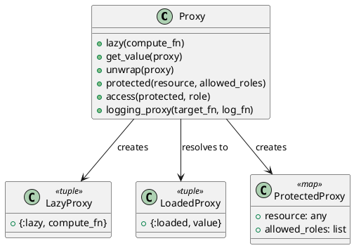

# 第 11 章 遅延評価とアクセス制御で間接化する — Proxy

## はじめに

Proxy パターンは、他のオブジェクトへのアクセスを制御するための代理を提供するパターンです。Elixir では遅延評価（関数のラップ）とパターンマッチングによるアクセス制御で実現します。

## パターンの構造



## Elixir イディオム: タグ付きタプルと関数ラップ

### 遅延ロードプロキシ

```elixir
def lazy(compute_fn), do: {:lazy, compute_fn}

def get_value({:lazy, compute_fn}) do
  value = compute_fn.()
  {:loaded, value}
end

def get_value({:loaded, value}), do: {:loaded, value}
```

### アクセス制御プロキシ

```elixir
def access(%{allowed_roles: allowed_roles, resource: resource}, role) do
  if role in allowed_roles do
    {:ok, resource}
  else
    {:error, :access_denied}
  end
end
```

## TDD で作る

### Red: 失敗するテストを書く

```elixir
test "アクセス制御プロキシで拒否されたロールはアクセスできない" do
  resource = Proxy.protected("secret data", [:admin])
  assert {:error, :access_denied} = Proxy.access(resource, :guest)
end
```

### Green: 最小限の実装

まずはアクセス制御プロキシだけを通し、許可されたロールなら `{:ok, resource}`、それ以外は `{:error, :access_denied}` を返す形にします。遅延ロードはその後に足せます。

### Refactor

遅延ロード、保護、ロギングは目的が異なるので、プロキシ生成関数を分けたまま並べておく方が読みやすくなります。

## unwrap/1 による値の取り出し

`unwrap/1` はプロキシの状態に関わらず値だけを取り出します。`get_value/1` はプロキシの状態遷移（`:lazy` から `:loaded` への変化）を追跡するのに対し、`unwrap/1` は状態を気にせず値を取得したい場合に使います。

```elixir
proxy = Proxy.lazy(fn -> expensive_computation() end)

# get_value/1 は状態遷移を返す
{:loaded, value} = Proxy.get_value(proxy)

# unwrap/1 は値だけを返す
value = Proxy.unwrap(proxy)
```

## ロギングプロキシ

`logging_proxy/2` は操作をログ記録付きでラップする高階関数です。`target_fn`（実際の処理）と `log_fn`（ログ記録）の 2 つの関数を受け取り、新しい関数を返します。

```elixir
test_pid = self()

target = fn args -> args * 2 end
logger = fn phase, data -> send(test_pid, {phase, data}) end

proxied = Proxy.logging_proxy(target, logger)

result = proxied.(5)
# => 10

# ログが記録されている
assert_received {:before, 5}
assert_received {:after, 10}
```

`log_fn` は `:before`（実行前）と `:after`（実行後）の 2 回呼ばれ、それぞれ引数と結果を受け取ります。アスペクト指向プログラミング（AOP）のアドバイスに相当する動作です。

## まとめ

- 遅延ロードプロキシはタグ付きタプルで状態遷移を表現
- `unwrap/1` で状態を無視して値だけを取得できる
- アクセス制御プロキシはパターンマッチングで権限を検証
- `logging_proxy/2` で操作の前後にログ処理を挟み込める
