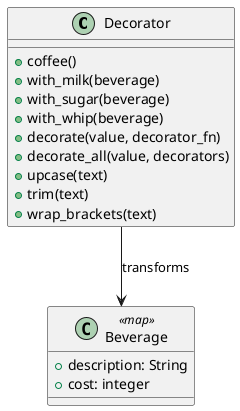

# 第 12 章 パイプラインで機能を積み重ねる — Decorator

## パターンの目的

Decorator パターンは、オブジェクトに動的に機能を追加するパターンです。Elixir ではパイプライン演算子 `|>` と関数合成で実現します。

## 構造



## 実装

各デコレータはマップを受け取り、新しいマップを返す関数です。

```elixir
def coffee, do: %{description: "Coffee", cost: 300}

def with_milk(beverage) do
  %{description: beverage.description <> ", Milk", cost: beverage.cost + 50}
end
```

パイプラインで直感的にデコレーションできます。

```elixir
beverage =
  Decorator.coffee()
  |> Decorator.with_milk()
  |> Decorator.with_sugar()
  |> Decorator.with_whip()
```

## テスト

```elixir
test "パイプラインでデコレーションする" do
  beverage =
    Decorator.coffee()
    |> Decorator.with_milk()
    |> Decorator.with_sugar()

  assert beverage.description == "Coffee, Milk, Sugar"
  assert beverage.cost == 380
end

test "文字列デコレータをパイプラインで適用する" do
  result =
    "  hello  "
    |> Decorator.trim()
    |> Decorator.upcase()
    |> Decorator.wrap_brackets()

  assert result == "[HELLO]"
end
```

## Elixir らしさ

- パイプライン演算子 `|>` が Decorator パターンの完璧な表現
- 各デコレータは純粋関数で、テストが容易
- `decorate_all/2` でデコレータのリストを動的に適用

## まとめ

- Decorator はパイプライン `|>` で自然に表現される
- 各デコレータは「データを受け取り、拡張したデータを返す関数」
- 不変データなので副作用がなく、テストしやすい
