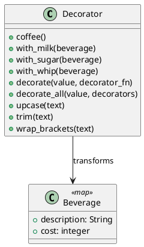

# 第 12 章 パイプラインで機能を積み重ねる — Decorator

## はじめに

Decorator パターンは、オブジェクトに動的に機能を追加するパターンです。Elixir ではパイプライン演算子 `|>` と関数合成で実現します。

## パターンの構造



## Elixir イディオム: パイプラインによる段階的変換

各デコレータはマップを受け取り、新しいマップを返す関数です。

```elixir
def coffee, do: %{description: "Coffee", cost: 300}

def with_milk(beverage) do
  %{description: beverage.description <> ", Milk", cost: beverage.cost + 50}
end
```

パイプラインで直感的にデコレーションできます。

```elixir
beverage =
  Decorator.coffee()
  |> Decorator.with_milk()
  |> Decorator.with_sugar()
  |> Decorator.with_whip()
```

## TDD で作る

### Red: 失敗するテストを書く

```elixir
test "パイプラインでデコレーションする" do
  beverage =
    Decorator.coffee()
    |> Decorator.with_milk()
    |> Decorator.with_sugar()

  assert beverage.description == "Coffee, Milk, Sugar"
  assert beverage.cost == 380
end

test "文字列デコレータをパイプラインで適用する" do
  result =
    "  hello  "
    |> Decorator.trim()
    |> Decorator.upcase()
    |> Decorator.wrap_brackets()

  assert result == "[HELLO]"
end
```

### Green: 最小限の実装

まずは `coffee/0` と `with_milk/1` のような 1 段だけの変換を通し、各デコレータが「入力を受けて拡張した値を返す関数」であることを固めます。

### Refactor

飲み物の装飾と文字列の装飾を並べると、Decorator が型ではなく変換パイプラインの考え方であることが伝わりやすくなります。

## Elixir らしさ

- パイプライン演算子 `|>` が Decorator パターンの完璧な表現
- 各デコレータは純粋関数で、テストが容易
- `decorate_all/2` でデコレータのリストを動的に適用

## まとめ

- Decorator はパイプライン `|>` で自然に表現される
- 各デコレータは「データを受け取り、拡張したデータを返す関数」
- 不変データなので副作用がなく、テストしやすい
