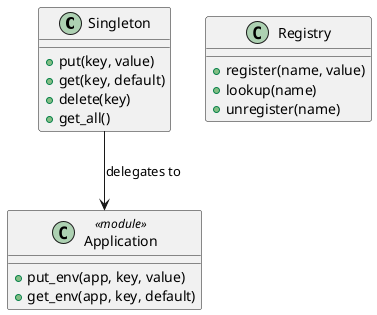

# 第 13 章 Application 環境で唯一の状態を管理する — Singleton

## はじめに

Singleton パターンは、あるクラスのインスタンスが 1 つだけであることを保証するパターンです。Elixir では Application 環境や GenServer でグローバルな状態を管理します。

## パターンの構造



## Elixir イディオム: Application 環境への委譲

Application 環境を使ったシンプルな実装です。

```elixir
@app :design_pattern

def put(key, value) do
  Application.put_env(@app, key, value)
end

def get(key, default \\\\ nil) do
  Application.get_env(@app, key, default)
end
```

## TDD で作る

### Red: 失敗するテストを書く

```elixir
test "設定値を保存・取得できる" do
  Singleton.put(:db_host, "localhost")
  assert Singleton.get(:db_host) == "localhost"
  Singleton.delete(:db_host)
end

test "存在しないキーにはデフォルト値を返す" do
  assert Singleton.get(:nonexistent, "default") == "default"
end
```

### Green: 最小限の実装

最初は `put/2` と `get/2` だけを `Application.put_env/3` と `Application.get_env/3` に委譲すれば十分です。削除や一覧取得は後続の拡張に回せます。

### Refactor

設定用途なら Application 環境、可変状態や並行アクセスが絡むなら GenServer や ETS に分けて考えるのが実践的です。

## Elixir における代替アプローチ

- **GenServer**: プロセスとして状態を管理。名前付き登録で唯一性を保証
- **ETS**: Erlang Term Storage による高速な共有テーブル
- **Agent**: 状態管理に特化したプロセス

## まとめ

- Elixir では Application 環境が設定のシングルトンとして機能する
- GenServer や ETS でより高度な状態管理が可能
- 関数型言語ではグローバルな可変状態は最小限にすべき
