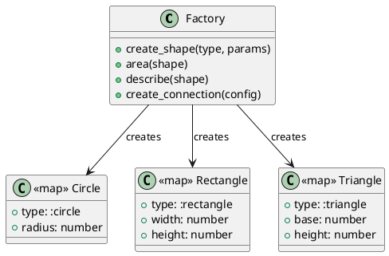

# 第 14 章 パターンマッチングで適切なデータを生成する — Factory

## パターンの目的

Factory パターンは、オブジェクトの生成をサブクラスに委ねるパターンです。Elixir ではパターンマッチングを使ったファクトリ関数で実現します。

## 構造



## 実装

アトムによるパターンマッチングで生成するデータを選択します。

```elixir
def create_shape(:circle, radius) do
  %{type: :circle, radius: radius}
end

def create_shape(:rectangle, {width, height}) do
  %{type: :rectangle, width: width, height: height}
end

def area(%{type: :circle, radius: r}), do: :math.pi() * r * r
def area(%{type: :rectangle, width: w, height: h}), do: w * h
```

## テスト

```elixir
test "円を作成して面積を計算する" do
  circle = Factory.create_shape(:circle, 5)
  assert circle.type == :circle
  assert_in_delta Factory.area(circle), 78.54, 0.01
end
```

## Elixir らしさ

- アトムでオブジェクトの種類を表現
- パターンマッチングで生成と操作を分岐
- マップでデータを構造化（構造体も使用可能）

## まとめ

- Factory はパターンマッチングによるファクトリ関数で表現する
- アトムが型タグとして機能する
- 同じパターンマッチングで生成と操作の両方を実現
