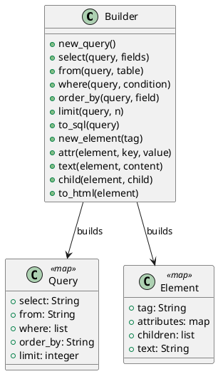

# 第 15 章 パイプラインで段階的に構築する — Builder

## はじめに

Builder パターンは、複雑なオブジェクトの構築を段階的に行うパターンです。Elixir ではパイプライン演算子 `|>` と Map 操作で段階的にデータを構築します。

## パターンの構造



## Elixir イディオム: Map 更新をパイプラインでつなぐ

各ビルダー関数はマップを受け取り、更新したマップを返します。

```elixir
def new_query do
  %{select: "*", from: nil, where: [], order_by: nil, limit: nil}
end

def select(query, fields), do: %{query | select: fields}
def from(query, table), do: %{query | from: table}
def where(query, condition) do
  %{query | where: query.where ++ [condition]}
end
```

パイプラインで直感的に構築できます。

```elixir
sql =
  Builder.new_query()
  |> Builder.select("name, age")
  |> Builder.from("users")
  |> Builder.where("age > 18")
  |> Builder.limit(10)
  |> Builder.to_sql()
```

## TDD で作る

### Red: 失敗するテストを書く

```elixir
test "クエリをパイプラインで構築して SQL に変換する" do
  sql =
    Builder.new_query()
    |> Builder.select("name, age")
    |> Builder.from("users")
    |> Builder.where("age > 18")
    |> Builder.order_by("name")
    |> Builder.limit(10)
    |> Builder.to_sql()

  assert sql == "SELECT name, age FROM users WHERE age > 18 ORDER BY name LIMIT 10"
end
```

### Green: 最小限の実装

最初は `new_query/0`、`select/2`、`from/2`、`to_sql/1` だけを実装し、最低限の SQL が組み立てられる状態を作ります。条件や並び順は後から足して十分です。

### Refactor

クエリビルダーと HTML ビルダーのように対象を分けて並べると、Builder が「段階的に組み立てる流れ」自体のパターンだと分かりやすくなります。

## まとめ

- Builder はパイプライン `|>` と Map 操作で段階的に構築する
- 各ビルダー関数は不変データの変換として表現される
- `to_sql/1` や `to_html/1` で最終的なデータに変換する
