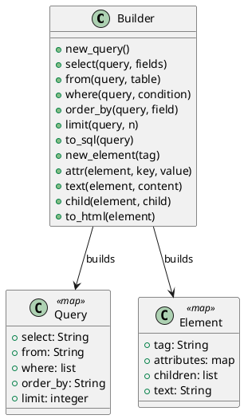

# 第 15 章 パイプラインで段階的に構築する — Builder

## はじめに

Builder パターンは、複雑なオブジェクトの構築を段階的に行うパターンです。Elixir ではパイプライン演算子 `|>` と Map 操作で段階的にデータを構築します。

## パターンの構造



## Elixir イディオム: Map 更新をパイプラインでつなぐ

各ビルダー関数はマップを受け取り、更新したマップを返します。

```elixir
def new_query do
  %{select: "*", from: nil, where: [], order_by: nil, limit: nil}
end

def select(query, fields), do: %{query | select: fields}
def from(query, table), do: %{query | from: table}
def where(query, condition) do
  %{query | where: query.where ++ [condition]}
end
```

パイプラインで直感的に構築できます。

```elixir
sql =
  Builder.new_query()
  |> Builder.select("name, age")
  |> Builder.from("users")
  |> Builder.where("age > 18")
  |> Builder.limit(10)
  |> Builder.to_sql()
```

## TDD で作る

### Red: 失敗するテストを書く

```elixir
test "クエリをパイプラインで構築して SQL に変換する" do
  sql =
    Builder.new_query()
    |> Builder.select("name, age")
    |> Builder.from("users")
    |> Builder.where("age > 18")
    |> Builder.order_by("name")
    |> Builder.limit(10)
    |> Builder.to_sql()

  assert sql == "SELECT name, age FROM users WHERE age > 18 ORDER BY name LIMIT 10"
end
```

### Green: 最小限の実装

最初は `new_query/0`、`select/2`、`from/2`、`to_sql/1` だけを実装し、最低限の SQL が組み立てられる状態を作ります。条件や並び順は後から足して十分です。

### Refactor

クエリビルダーと HTML ビルダーのように対象を分けて並べると、Builder が「段階的に組み立てる流れ」自体のパターンだと分かりやすくなります。

## HTML 要素ビルダー

クエリビルダーと同じパイプラインの考え方で、HTML 要素を段階的に構築できます。

### 要素の作成と属性の追加

```elixir
element =
  Builder.new_element("div")
  |> Builder.attr("class", "container")
  |> Builder.attr("id", "main")
```

`new_element/1` はタグ名を受け取り、空の属性・子要素・テキストを持つマップを返します。

```elixir
def new_element(tag) do
  %{tag: tag, attributes: %{}, children: [], text: nil}
end
```

### テキストの設定

`text/2` で要素のテキストコンテンツを設定します。

```elixir
Builder.new_element("p")
|> Builder.text("Hello, World!")
|> Builder.to_html()
# => "<p>Hello, World!</p>"
```

### 子要素の追加

`child/2` で子要素をネストできます。子要素もビルダーで構築します。

```elixir
html =
  Builder.new_element("div")
  |> Builder.attr("class", "container")
  |> Builder.child(
    Builder.new_element("h1")
    |> Builder.text("Title")
  )
  |> Builder.child(
    Builder.new_element("p")
    |> Builder.text("Content")
  )
  |> Builder.to_html()

# => "<div class=\"container\"><h1>Title</h1><p>Content</p></div>"
```

### to_html/1 の変換ルール

`to_html/1` は以下の優先順位で内部コンテンツを決定します。

1. `text` が設定されていればテキストを出力
2. `children` が存在すれば子要素を再帰的に HTML に変換して出力
3. どちらもなければ空の要素を出力

属性は `key="value"` 形式でタグに付与されます。

## まとめ

- Builder はパイプライン `|>` と Map 操作で段階的に構築する
- 各ビルダー関数は不変データの変換として表現される
- `to_sql/1` でクエリを SQL 文字列に変換する
- `new_element/1`、`attr/3`、`text/2`、`child/2`、`to_html/1` で HTML を段階的に構築する
