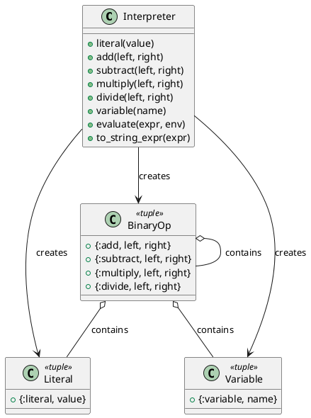

# 第 16 章 タグ付きタプルで言語を解釈する — Interpreter

## はじめに

Interpreter パターンは、言語の文法を定義し、その文法に基づいて式を解釈するパターンです。Elixir ではタグ付きタプルで AST（抽象構文木）を表現し、再帰的パターンマッチングで評価します。

## パターンの構造



## Elixir イディオム: タグ付きタプルを再帰的に評価する

タグ付きタプルで式を構築し、パターンマッチングで再帰的に評価します。

```elixir
def evaluate({:literal, value}, _env), do: value

def evaluate({:add, left, right}, env) do
  evaluate(left, env) + evaluate(right, env)
end

def evaluate({:variable, name}, env) do
  Map.fetch!(env, name)
end
```

変数を含む式は環境マップで値を解決します。

```elixir
expr = Interpreter.add(Interpreter.variable(:x), Interpreter.literal(10))
Interpreter.evaluate(expr, %{x: 5})  # => 15
```

## TDD で作る

### Red: 失敗するテストを書く

```elixir
test "ネストした式を評価する" do
  # (2 + 3) * 4 = 20
  expr =
    Interpreter.multiply(
      Interpreter.add(Interpreter.literal(2), Interpreter.literal(3)),
      Interpreter.literal(4)
    )
  assert Interpreter.evaluate(expr) == 20
end

test "ゼロ除算はエラーを返す" do
  expr = Interpreter.divide(Interpreter.literal(10), Interpreter.literal(0))
  assert Interpreter.evaluate(expr) == {:error, :division_by_zero}
end
```

### Green: 最小限の実装

まずは `{:literal, value}` と `{:add, left, right}` を評価できるようにし、再帰評価の骨格を固めます。変数やエラー処理はそのあとに拡張します。

### Refactor

AST の構築関数と評価関数を分けておくと、`to_string_expr/1` のような別の解釈器を後付けしやすくなります。

## Elixir らしさ

- タグ付きタプルが AST ノードの自然な表現
- パターンマッチングで各ノード型の評価ロジックを分離
- 環境マップで変数の束縛を管理
- Elixir 自体がマクロで AST を操作する言語であり、Interpreter パターンは言語の本質に近い

## まとめ

- Interpreter はタグ付きタプルと再帰的パターンマッチングで表現する
- 環境マップで変数のスコープを管理
- Elixir のマクロシステムとの親和性が高い
- `to_string_expr/1` で式の文字列表現も提供
