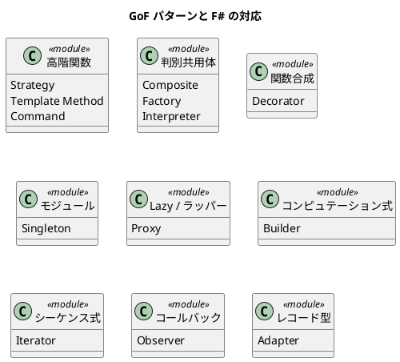

# 第 1 章：パターン入門 — なぜ関数型でパターンを学ぶのか

## はじめに

デザインパターンは、ソフトウェア設計における繰り返し発生する問題への定石的な解決策です。GoF（Gang of Four）が 1994 年に体系化した 23 のパターンは、オブジェクト指向プログラミングの文脈で生まれました。

F# のような関数型ファーストの言語では、多くの GoF パターンが言語機能として組み込まれています。Peter Norvig が指摘したように、「デザインパターンの多くは、言語の制約を補うものである」のです。

## 「パターンが不要になる」関数型の視点

OOP では、振る舞いの差し替えにインターフェースと継承を使います。F# では、関数が第一級値であるため、関数を渡すだけで同じことが実現できます。

```fsharp
// OOP 的アプローチ（C#）:
// interface IStrategy { string Format(string text); }
// class HtmlStrategy : IStrategy { ... }

// F# のアプローチ: 関数を渡すだけ
let format (strategy: string -> string) text = strategy text
let html text = sprintf "<p>%s</p>" text
let result = format html "Hello"
```

## パターンの構造



## TDD で学ぶ

本シリーズでは、すべてのパターンを TDD（テスト駆動開発）で実装します。

1. **Red** — パターンの振る舞いを表現する失敗テストを書く
2. **Green** — テストを通す最小の F# コードを書く
3. **Refactor** — 関数型イディオムでコードを改善する

## OOP 版（C#）との比較

各章では、C# での典型的な実装と F# での実装を比較します。これにより、関数型言語がどのようにパターンの複雑さを解消するかを理解できます。

## 開発環境と品質チェック

### プロジェクト構成

```
apps/fsharp/design-pattern/
├── DesignPattern.sln           # ソリューション
├── .editorconfig               # フォーマット設定
├── .config/dotnet-tools.json   # ローカルツール定義
├── src/DesignPattern/          # ソースコード
│   ├── TemplateMethod.fs
│   └── ...
└── tests/DesignPattern.Tests/  # テストコード
    ├── TemplateMethodTests.fs
    └── ...
```

### テスト実行

```bash
cd apps/fsharp/design-pattern
dotnet test
```

### 静的コード解析: Fantomas

Fantomas は F# のコードフォーマッターです。`.editorconfig` で設定し、プロジェクト全体のコードスタイルを統一します。

```bash
# フォーマットの実行
dotnet fantomas src/ tests/

# フォーマット違反のチェック（CI 向け）
dotnet fantomas --check src/ tests/
```

#### .editorconfig の設定

```ini
[*.fs]
indent_style = space
indent_size = 4
fsharp_max_line_length = 120
fsharp_space_before_parameter = true
fsharp_multiline_bracket_style = cramped
fsharp_max_array_or_list_width = 80
```

### コード複雑度のチェック

F# の型システムは非常に強力で、判別共用体とパターンマッチにより多くの実行時エラーをコンパイル時に検出します。

| 手法 | 説明 |
|------|------|
| コンパイラ警告 | 不完全なパターンマッチ、未使用変数の検出 |
| Fantomas | コードスタイルの一貫性を保証 |
| 型システム | 判別共用体で不正な状態を表現不能にする |

### 品質チェックの一括実行

```bash
# フォーマットチェック + テスト
dotnet fantomas --check src/ tests/ && dotnet test
```

### 各言語の品質ツール比較

| 用途 | F# | Ruby | Java | TypeScript | Python |
|------|-----|------|------|-----------|--------|
| パッケージ管理 | NuGet | Bundler | Gradle | npm | uv |
| テスト | xUnit | minitest | JUnit 5 | Jest | pytest |
| 静的解析 | Fantomas + コンパイラ | RuboCop | Checkstyle + PMD | ESLint | Ruff |
| フォーマッター | Fantomas | RuboCop | Checkstyle | Prettier | Ruff |
| カバレッジ | coverlet | SimpleCov | JaCoCo | @vitest/coverage-v8 | pytest-cov |
| 複雑度チェック | コンパイラ + 型システム | RuboCop Metrics | PMD | ESLint complexity | Ruff McCabe |

---

## まとめ

- GoF パターンの多くは、OOP 言語の制約を補うために存在する
- F# では言語機能が直接パターンの役割を果たす
- パターンの「意図」は有効だが、「実装」は大幅に簡素化される
- TDD で段階的にパターンを学ぶことで、実践的な理解が得られる
- Fantomas でコードスタイルを統一し、`dotnet fantomas --check && dotnet test` で品質チェックを一括実行できる
