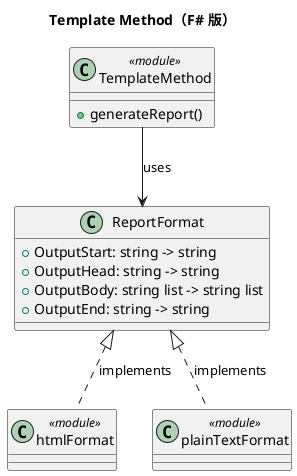

# 第 2 章：Template Method — 高階関数で「穴埋め」する

## はじめに

Template Method パターンは、アルゴリズムの骨格を定義し、一部のステップをサブクラスに委ねるパターンです。F# では、抽象クラスと継承の代わりに、高階関数とレコード型で表現します。

## パターンの構造



## TDD で作る

### Red: 失敗するテストを書く

```fsharp
[<Fact>]
let ``HTML フォーマットでレポートを生成できる`` () =
    let result = generateReport htmlFormat "テストレポート" [ "項目1"; "項目2" ]
    Assert.Equal("<html>", result.[0])
    Assert.Contains("テストレポート", result.[1])
    Assert.Equal("</html>", result |> List.last)
```

### Green: テストを通す最小のコードを書く

```fsharp
type ReportFormat =
    { OutputStart: string -> string
      OutputHead: string -> string
      OutputBody: string list -> string list
      OutputEnd: string -> string }

let generateReport (format: ReportFormat) (title: string) (items: string list) =
    let startLine = format.OutputStart title
    let headLine = format.OutputHead title
    let bodyLines = format.OutputBody items
    let endLine = format.OutputEnd title
    [ startLine; headLine ] @ bodyLines @ [ endLine ]

let htmlFormat =
    { OutputStart = fun _ -> "<html>"
      OutputHead = fun title -> sprintf "  <head><title>%s</title></head>" title
      OutputBody = fun items -> items |> List.map (fun item -> sprintf "  <body>%s</body>" item)
      OutputEnd = fun _ -> "</html>" }

let plainTextFormat =
    { OutputStart = fun _ -> "********"
      OutputHead = fun title -> sprintf "TITLE: %s" title
      OutputBody = fun items -> items |> List.map (sprintf "- %s")
      OutputEnd = fun _ -> "********" }
```

`generateReport` は骨格だけを保持し、出力開始・見出し・本文・終了の差分を `ReportFormat` に閉じ込めます。

### Refactor: 設計を改善する

F# 版はすでにシンプルです。レコード型の各フィールドが「穴」に相当し、関数で埋めます。

## OOP 版（C#）との比較

### C# 版

```csharp
abstract class Report {
    public void GenerateReport(string title, List<string> items) {
        OutputStart(title);
        OutputHead(title);
        foreach (var item in items) OutputBody(item);
        OutputEnd(title);
    }
    protected abstract void OutputStart(string title);
    protected abstract void OutputHead(string title);
    protected abstract void OutputBody(string item);
    protected abstract void OutputEnd(string title);
}

class HtmlReport : Report {
    protected override void OutputStart(string title) => Console.WriteLine("<html>");
    // ... 他のメソッドも同様
}
```

### F# 版

- 抽象クラスが不要（レコード型で十分）
- 継承が不要（関数フィールドを差し替えるだけ）
- 新しいフォーマットの追加が容易（レコードを定義するだけ）

## まとめ

- Template Method の「穴埋め」は、F# ではレコード型の関数フィールドで表現する
- 継承階層が不要になり、フラットな設計になる
- 新しいバリエーションはレコードのインスタンスを作るだけで追加できる
