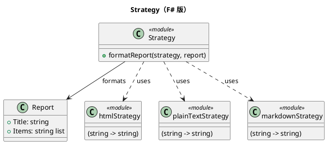

# 第 3 章：Strategy — 関数を値として渡す

## はじめに

Strategy パターンは、アルゴリズムをカプセル化して交換可能にするパターンです。F# では、関数が第一級値なので、インターフェースは不要です。関数を渡すだけで Strategy パターンが実現されます。

## パターンの構造



## TDD で作る

### Red: 失敗するテストを書く

```fsharp
[<Fact>]
let ``HTML 戦略でレポートをフォーマットできる`` () =
    let report = { Title = "テスト"; Items = [ "項目1"; "項目2" ] }
    let result = formatReport htmlStrategy report
    Assert.Contains("<p>テスト</p>", result)
```

### Green: テストを通す最小のコードを書く

```fsharp
type FormatStrategy = string -> string

type Report = { Title: string; Items: string list }

let formatReport (strategy: FormatStrategy) (report: Report) =
    let header = strategy report.Title
    let body = report.Items |> List.map strategy |> String.concat "\n"
    sprintf "%s\n%s" header body

let htmlStrategy : FormatStrategy = fun text -> sprintf "<p>%s</p>" text
let plainTextStrategy : FormatStrategy = id
let markdownStrategy : FormatStrategy = fun text -> sprintf "* %s" text
```

戦略の差し替えは値の差し替えそのもので、`Report` 側には分岐が一切入りません。

### Refactor

関数の型エイリアスにより、意図が明確になっています。これ以上のリファクタリングは不要です。

## OOP 版（C#）との比較

### C# 版

```csharp
interface IFormatStrategy {
    string Format(string text);
}
class HtmlStrategy : IFormatStrategy {
    public string Format(string text) => $"<p>{text}</p>";
}
class ReportContext {
    private IFormatStrategy _strategy;
    public ReportContext(IFormatStrategy strategy) { _strategy = strategy; }
    public string Format(string text) => _strategy.Format(text);
}
```

### F# 版の優位性

- インターフェース定義が不要
- クラス定義が不要
- ラムダ式でその場で戦略を定義できる
- コード量が大幅に削減される

## まとめ

- Strategy パターンは F# では「関数を引数として渡す」だけで実現される
- インターフェースもクラスも不要で、関数の型エイリアスで意図を表現する
- ラムダ式でインラインに戦略を定義できるため、小さな戦略も自然に扱える
