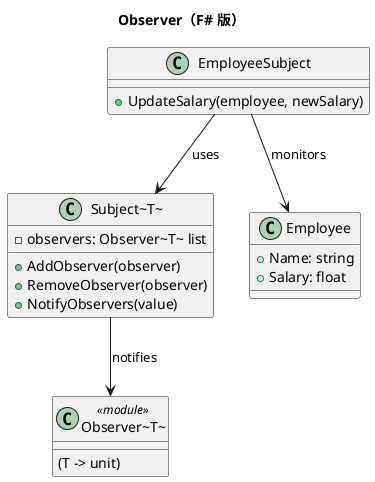

# 第 4 章：Observer — コールバック関数とイベント

## はじめに

Observer パターンは、オブジェクトの状態変化を他のオブジェクトに通知するパターンです。F# ではコールバック関数のリストや、組み込みの Event 型で実現できます。

## パターンの構造



## TDD で作る

### Red: 失敗するテストを書く

```fsharp
[<Fact>]
let ``オブザーバーに通知が届く`` () =
    let subject = Subject<string>()
    let mutable received = ""
    subject.AddObserver(fun msg -> received <- msg)
    subject.NotifyObservers("テスト通知")
    Assert.Equal("テスト通知", received)
```

### Green: テストを通す最小のコードを書く

```fsharp
type Observer<'T> = 'T -> unit

type Subject<'T>() =
    let mutable observers : Observer<'T> list = []
    member _.AddObserver(observer) = observers <- observer :: observers
    member _.NotifyObservers(value) =
        observers |> List.iter (fun observer -> observer value)

type Employee = { Name: string; Salary: float }

type EmployeeSubject() =
    let subject = Subject<Employee>()
    member _.AddObserver(observer) = subject.AddObserver(observer)
    member _.UpdateSalary(employee, newSalary) =
        let updated = { employee with Salary = newSalary }
        subject.NotifyObservers(updated)
        updated
```

通知の仕組みは汎用の `Subject<'T>` に閉じ込め、ドメイン固有の更新処理だけを `EmployeeSubject` に乗せる構成です。

### オブザーバーの削除と件数管理

`Subject<'T>` は `RemoveObserver` メソッドでオブザーバーの登録解除を、`ObserverCount` プロパティで現在の購読数の確認をサポートしています。

```fsharp
member _.RemoveObserver(observer: Observer<'T>) =
    observers <- observers |> List.filter (fun o -> not (obj.ReferenceEquals(o, observer)))

member _.ObserverCount = observers.Length
```

`RemoveObserver` は `obj.ReferenceEquals` を使って参照同一性でオブザーバーを特定し、リストから除外します。`EmployeeSubject` にも同様のメソッドが委譲されています。

```fsharp
[<Fact>]
let ``オブザーバーを削除できる`` () =
    let subject = Subject<string>()
    let observer: Observer<string> = fun _ -> ()
    subject.AddObserver(observer)
    Assert.Equal(1, subject.ObserverCount)
    subject.RemoveObserver(observer)
    Assert.Equal(0, subject.ObserverCount)
```

### Refactor

通知の仕組みをジェネリックにし、従業員の給与変更監視に特化した `EmployeeSubject` を追加しました。`RemoveObserver` と `ObserverCount` により、購読のライフサイクル管理も可能です。

## OOP 版（C#）との比較

### C# 版

```csharp
interface IObserver { void Update(string message); }
class Subject {
    private List<IObserver> observers = new();
    public void Attach(IObserver o) => observers.Add(o);
    public void Notify(string msg) => observers.ForEach(o => o.Update(msg));
}
```

### F# 版の優位性

- オブザーバーはただの関数（`'T -> unit`）
- インターフェースの定義が不要
- ラムダ式でインラインにオブザーバーを登録できる

## まとめ

- Observer はコールバック関数のリストで実装できる
- F# のジェネリクスにより、型安全な通知が実現される
- 関数型の Observer は OOP 版よりシンプルだが、ミュータブルな状態を持つ点は同じ
