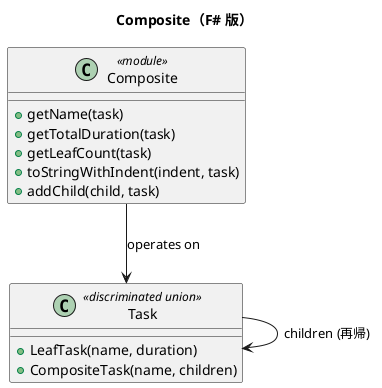

# 第 5 章：Composite — 判別共用体で木構造を表現する

## はじめに

Composite パターンは、個々のオブジェクトとオブジェクトの集合を同一視して扱うパターンです。F# では、再帰的な判別共用体（Discriminated Union）で自然に表現できます。

## パターンの構造



## TDD で作る

### Red: 失敗するテストを書く

```fsharp
[<Fact>]
let ``CompositeTask の合計所要時間を計算できる`` () =
    let project =
        CompositeTask("プロジェクト", [
            LeafTask("設計", 2.0)
            LeafTask("実装", 5.0)
            LeafTask("テスト", 3.0)
        ])
    Assert.Equal(10.0, getTotalDuration project)
```

### Green: テストを通す最小のコードを書く

```fsharp
type Task =
    | LeafTask of name: string * duration: float
    | CompositeTask of name: string * children: Task list

let rec getTotalDuration = function
    | LeafTask(_, duration) -> duration
    | CompositeTask(_, children) ->
        children |> List.sumBy getTotalDuration
```

### Refactor

パターンマッチングにより、各ケースの処理が明確に分離されています。`function` キーワードで引数を直接マッチングする F# のイディオムを使っています。

## OOP 版（C#）との比較

### C# 版

```csharp
abstract class TaskComponent {
    public abstract string Name { get; }
    public abstract double GetTotalDuration();
}
class LeafTask : TaskComponent { ... }
class CompositeTask : TaskComponent {
    private List<TaskComponent> children = new();
    public override double GetTotalDuration() =>
        children.Sum(c => c.GetTotalDuration());
}
```

### F# 版の優位性

- 判別共用体 1 つでクラス階層全体を表現
- パターンマッチングで網羅性チェック（新しいケース追加時にコンパイラが警告）
- イミュータブルなデータ構造

## まとめ

- Composite は判別共用体の最も自然な用途の一つ
- 再帰的な判別共用体で木構造を直接表現できる
- パターンマッチングにより、すべてのケースの網羅性がコンパイル時に保証される
