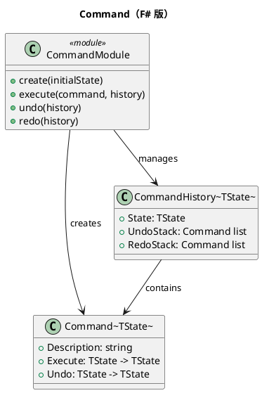

# 第 7 章：Command — 関数でコマンドを表現する

## はじめに

Command パターンは、操作をオブジェクトとしてカプセル化し、実行・取り消し・やり直しを可能にします。F# では、`Execute` と `Undo` の関数フィールドを持つレコード型で表現します。

## パターンの構造



## TDD で作る

### Red: 失敗するテストを書く

```fsharp
[<Fact>]
let ``コマンドを取り消せる`` () =
    let history =
        create ""
        |> execute (appendText "Hello")
        |> execute (appendText " World")
        |> undo
    Assert.Equal("Hello", history.State)
```

### Green: テストを通す最小のコードを書く

```fsharp
type Command<'TState> =
    { Description: string
      Execute: 'TState -> 'TState
      Undo: 'TState -> 'TState }

type CommandHistory<'TState> =
    { State: 'TState
      UndoStack: Command<'TState> list
      RedoStack: Command<'TState> list }

let create initialState =
    { State = initialState
      UndoStack = []
      RedoStack = [] }

let execute command history =
    { State = command.Execute history.State
      UndoStack = command :: history.UndoStack
      RedoStack = [] }

let undo (history: CommandHistory<'TState>) =
    match history.UndoStack with
    | [] -> history
    | lastCommand :: rest ->
        { State = lastCommand.Undo history.State
          UndoStack = rest
          RedoStack = lastCommand :: history.RedoStack }

let appendText text =
    { Description = sprintf "append %s" text
      Execute = fun state -> state + text
      Undo = fun state -> state.Substring(0, state.Length - text.Length) }
```

コマンドを「状態変換のペア」として持つため、実行履歴の管理は純粋なレコード更新に落とし込めます。

### Redo: 取り消したコマンドをやり直す

`redo` 関数は `RedoStack` から直前に取り消されたコマンドを取り出し、再実行します。`undo` が `RedoStack` にコマンドを積むため、undo と redo を交互に行き来できます。

```fsharp
let redo (history: CommandHistory<'TState>) =
    match history.RedoStack with
    | [] -> history
    | lastCommand :: rest ->
        { State = lastCommand.Execute history.State
          UndoStack = lastCommand :: history.UndoStack
          RedoStack = rest }
```

新しいコマンドが `execute` されると `RedoStack` はクリアされます。これにより、undo 後に新しい操作を行った場合、古い redo 履歴が無効化される一般的な振る舞いを実現しています。

```fsharp
[<Fact>]
let ``取り消したコマンドをやり直せる`` () =
    let history =
        create ""
        |> execute (appendText "Hello")
        |> execute (appendText " World")
        |> undo
        |> redo
    Assert.Equal("Hello World", history.State)

[<Fact>]
let ``空の redo スタックで redo しても安全`` () =
    let history = create "test"
    let history = redo history
    Assert.Equal("test", history.State)
```

### Refactor

パイプライン演算子（`|>`）により、コマンドの連鎖が読みやすくなっています。イミュータブルな `CommandHistory` により、各状態のスナップショットが自然に保持されます。

## OOP 版（C#）との比較

### C# 版

```csharp
interface ICommand {
    void Execute();
    void Undo();
}
class AppendTextCommand : ICommand {
    private string text;
    private StringBuilder buffer;
    public void Execute() => buffer.Append(text);
    public void Undo() => buffer.Remove(buffer.Length - text.Length, text.Length);
}
```

### F# 版の優位性

- コマンドはレコード型（インターフェース不要）
- 状態がイミュータブル（Execute は新しい状態を返す）
- パイプラインでコマンドを連鎖できる

## まとめ

- Command は関数フィールドを持つレコード型で表現する
- イミュータブルな状態管理により、取り消し・やり直しが安全に実装できる
- パイプライン演算子でコマンドの実行が直感的に記述できる
