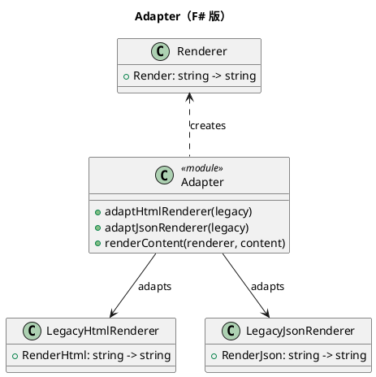

# 第 8 章：Adapter — レコード型とアダプター関数

## はじめに

Adapter パターンは、互換性のないインターフェースを持つクラスを協調させるパターンです。F# では、レコード型で統一インターフェースを定義し、アダプター関数で変換します。

## パターンの構造



## TDD で作る

### Red: 失敗するテストを書く

```fsharp
[<Fact>]
let ``LegacyHtmlRenderer をアダプタ経由で使える`` () =
    let legacy = createLegacyHtmlRenderer ()
    let renderer = adaptHtmlRenderer legacy
    let result = renderContent renderer "テスト"
    Assert.Equal("<html><body>テスト</body></html>", result)
```

### Green: テストを通す最小のコードを書く

```fsharp
type Renderer = { Render: string -> string }

type LegacyHtmlRenderer =
    { RenderHtml: string -> string }

type LegacyJsonRenderer =
    { RenderJson: string -> string }

let adaptHtmlRenderer (legacy: LegacyHtmlRenderer) : Renderer =
    { Render = legacy.RenderHtml }

let adaptJsonRenderer (legacy: LegacyJsonRenderer) : Renderer =
    { Render = legacy.RenderJson }

let renderContent (renderer: Renderer) content =
    renderer.Render content
```

アダプタはオブジェクトを包むよりも、「必要な形のレコードを組み直す」方が F# では自然です。

### Refactor

アダプター関数は、旧式のレコード型のフィールドを新しいレコード型のフィールドにマッピングするだけです。

## OOP 版（C#）との比較

### C# 版

```csharp
interface IRenderer { string Render(string content); }
class HtmlRendererAdapter : IRenderer {
    private LegacyHtmlRenderer legacy;
    public string Render(string content) => legacy.RenderHtml(content);
}
```

### F# 版の優位性

- アダプタークラスが不要（関数で変換するだけ）
- レコード型のフィールドマッピングで直感的
- 新しいアダプターの追加が 1 行の関数で完了

## まとめ

- Adapter はレコード型のフィールドマッピング関数で実現される
- クラスの継承やインターフェースの実装は不要
- アダプター関数は合成可能で、テストしやすい
