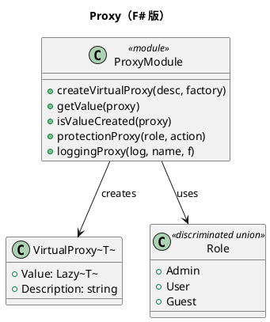

# 第 9 章：Proxy — Lazy と関数ラッパー

## はじめに

Proxy パターンは、他のオブジェクトへのアクセスを制御する代理を提供します。F# では `Lazy<T>` で仮想プロキシ（遅延初期化）、関数ラッパーで保護プロキシ（アクセス制御）を表現します。

## パターンの構造



## TDD で作る

### Red: 仮想プロキシのテスト

```fsharp
[<Fact>]
let ``仮想プロキシは初回アクセスまで値を生成しない`` () =
    let mutable created = false
    let proxy = createVirtualProxy "テスト" (fun () ->
        created <- true
        42)
    Assert.False(isValueCreated proxy)
    Assert.False(created)
```

### Green: Lazy を使った仮想プロキシ

```fsharp
type VirtualProxy<'T> =
    { Value: Lazy<'T>; Description: string }

let createVirtualProxy description factory =
    { Value = lazy (factory ()); Description = description }

let getValue proxy = proxy.Value.Value

let isValueCreated proxy = proxy.Value.IsValueCreated
```

`Lazy<'T>` に初回評価とキャッシュが含まれているため、Virtual Proxy 専用の状態管理を自前で持つ必要がありません。

### Red: 保護プロキシのテスト

```fsharp
[<Fact>]
let ``保護プロキシは権限がなければアクセスを拒否する`` () =
    let action input = Ok (sprintf "処理完了: %s" input)
    let protectedAction = protectionProxy Admin action
    let result = protectedAction Guest "データ"
    match result with
    | Error msg -> Assert.Contains("アクセス拒否", msg)
    | Ok _ -> Assert.Fail("アクセスが許可されるべきではない")
```

### Green: 関数ラッパーでアクセス制御

```fsharp
type Role = Admin | User | Guest

let roleLevel = function
    | Guest -> 0
    | User -> 1
    | Admin -> 2

let protectionProxy requiredRole action role input =
    if roleLevel role >= roleLevel requiredRole then
        action input
    else
        Error (sprintf "アクセス拒否: %A 権限が必要です" requiredRole)

let loggingProxy log name f input =
    log (sprintf "start: %s" name)
    let result = f input
    log (sprintf "finish: %s" name)
    result
```

保護・ロギングのどちらも「元の関数を包む関数」として表現でき、ラッパー同士の合成も容易です。

## OOP 版（C#）との比較

- C# では Proxy クラスが Subject と同じインターフェースを実装する
- F# では `Lazy<T>` と関数ラッパーで同じことがより簡潔に実現できる

## まとめ

- 仮想プロキシは `Lazy<T>` で自然に表現される
- 保護プロキシは関数ラッパー（高階関数）で実現される
- ログプロキシもデコレーター的な関数ラッパーで実装できる
