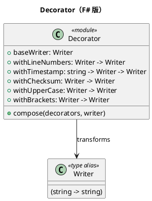

# 第 10 章：Decorator — 関数合成でデコレートする

## はじめに

Decorator パターンは、オブジェクトに動的に機能を追加します。F# では、関数合成（`>>`）や高階関数で、関数にデコレーターを適用するパイプラインを構築します。

## パターンの構造



## TDD で作る

### Red: 失敗するテストを書く

```fsharp
[<Fact>]
let ``複数のデコレーターを合成できる`` () =
    let writer = compose [ withUpperCase; withBrackets ] baseWriter
    let result = writer "hello"
    Assert.Equal("[ HELLO ]", result)
```

### Green: テストを通す最小のコードを書く

```fsharp
type Writer = string -> string

let baseWriter : Writer = fun text -> text

let withUpperCase : Writer -> Writer =
    fun writer text -> (writer text).ToUpper()

let withBrackets : Writer -> Writer =
    fun writer text -> sprintf "[ %s ]" (writer text)

let compose (decorators: (Writer -> Writer) list) (writer: Writer) : Writer =
    decorators |> List.fold (fun w decorator -> decorator w) writer

let withLineNumbers : Writer -> Writer =
    fun writer text -> sprintf "1: %s" (writer text)

let withTimestamp (timestamp: string) : Writer -> Writer =
    fun writer text -> sprintf "[%s] %s" timestamp (writer text)
```

Decorator の正体は `Writer -> Writer` の変換なので、追加機能ごとに小さな関数として独立させられます。

### Refactor

デコレーターは `Writer -> Writer` 型の関数です。`compose` 関数で複数のデコレーターを合成でき、適用順序を自由に制御できます。

## OOP 版（C#）との比較

### C# 版

```csharp
abstract class WriterDecorator : IWriter {
    protected IWriter writer;
    public WriterDecorator(IWriter writer) { this.writer = writer; }
}
class UpperCaseDecorator : WriterDecorator {
    public string Write(string text) => writer.Write(text).ToUpper();
}
```

### F# 版の優位性

- デコレータークラスが不要（関数で十分）
- 合成が `List.fold` で宣言的に記述できる
- デコレーターの適用順序が明確

## まとめ

- Decorator は `Writer -> Writer` 型の高階関数で表現される
- 関数合成により、デコレーターチェーンが自然に構築できる
- `compose` 関数で宣言的にデコレーターを組み合わせられる
