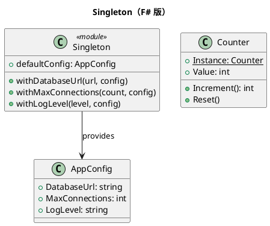

# 第 11 章：Singleton — モジュールレベル束縛

## はじめに

Singleton パターンは、クラスのインスタンスが 1 つだけであることを保証します。F# では、モジュールレベルの `let` 束縛が自然にシングルトンの役割を果たします。

## パターンの構造



## TDD で作る

### Red: 失敗するテストを書く

```fsharp
[<Fact>]
let ``デフォルト設定が存在する`` () =
    Assert.Equal("localhost:5432", defaultConfig.DatabaseUrl)
    Assert.Equal(10, defaultConfig.MaxConnections)
```

### Green: モジュールレベル束縛

```fsharp
type AppConfig =
    { DatabaseUrl: string; MaxConnections: int; LogLevel: string }

let defaultConfig =
    { DatabaseUrl = "localhost:5432"; MaxConnections = 10; LogLevel = "INFO" }
```

### Refactor

F# のモジュールレベル `let` 束縛は、一度だけ評価されるシングルトンです。イミュータブルなレコード型と組み合わせることで、変更には新しいインスタンスを返す関数を使います。

スレッドセーフなミュータブルシングルトンが必要な場合は、`Lazy<T>` を使います。

## OOP 版（C#）との比較

### C# 版

```csharp
class AppConfig {
    private static readonly Lazy<AppConfig> instance =
        new Lazy<AppConfig>(() => new AppConfig());
    public static AppConfig Instance => instance.Value;
    private AppConfig() { }
}
```

### F# 版の優位性

- モジュールレベルの値は自動的にシングルトン
- イミュータブルなので、スレッドセーフティの心配が少ない
- private コンストラクタなどの定型コードが不要

## まとめ

- F# のモジュールは自然にシングルトンの役割を果たす
- イミュータブルなレコード型と組み合わせるのが F# 的
- ミュータブルな状態が必要な場合は `Lazy<T>` を使う
