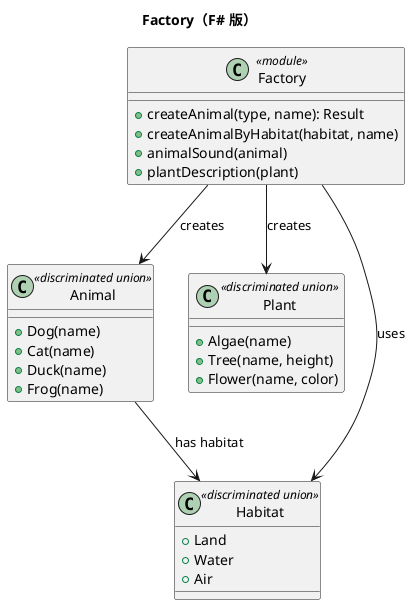

# 第 12 章：Factory — 判別共用体とファクトリ関数

## はじめに

Factory パターンは、オブジェクトの生成を専門の関数に委ねるパターンです。F# では、判別共用体でプロダクトの型を表現し、ファクトリ関数でインスタンスを生成します。

## パターンの構造



## TDD で作る

### Red: 失敗するテストを書く

```fsharp
[<Fact>]
let ``文字列から Dog を生成できる`` () =
    let result = createAnimal "dog" "ポチ"
    match result with
    | Ok(Dog name) -> Assert.Equal("ポチ", name)
    | _ -> Assert.Fail("Dog が期待される")
```

### Green: テストを通す最小のコードを書く

```fsharp
type Animal =
    | Dog of name: string
    | Cat of name: string
    | Duck of name: string
    | Frog of name: string

let createAnimal (animalType: string) (name: string) =
    match animalType.ToLower() with
    | "dog" -> Ok(Dog name)
    | "cat" -> Ok(Cat name)
    | unknown -> Error(sprintf "不明な動物タイプ: %s" unknown)

type Habitat = Land | Water | Air

let createAnimalByHabitat habitat name =
    match habitat with
    | Land -> Dog name
    | Water -> Frog name
    | Air -> Duck name

let animalSound = function
    | Dog _ -> "ワンワン"
    | Cat _ -> "ニャー"
    | Duck _ -> "ガーガー"
    | Frog _ -> "ケロケロ"
```

生成後の振る舞いも同じ判別共用体に対する関数として定義できるので、クラスごとのメソッド分散を避けられます。

### ヘルパー関数: animalName, animalHabitat, plantName

判別共用体の各ケースからフィールドを取り出すヘルパー関数が用意されています。パターンマッチングで全ケースを網羅し、型安全にフィールドを抽出します。

```fsharp
let animalName = function
    | Dog name | Cat name | Duck name | Frog name -> name

let animalHabitat = function
    | Dog _ | Cat _ -> Land
    | Duck _ -> Air
    | Frog _ -> Water

let plantName = function
    | Algae name -> name
    | Tree(name, _) -> name
    | Flower(name, _) -> name
```

`animalName` と `plantName` は判別共用体の各ケースに共通する `name` フィールドを取り出します。`animalHabitat` は動物の種類から `Habitat` 判別共用体へのマッピングを行います。

```fsharp
// 使用例
let dog = Dog "ポチ"
animalName dog      // "ポチ"
animalHabitat dog   // Land

let tree = Tree("桜", 10.5)
plantName tree      // "桜"
```

### Refactor

`Result` 型を使うことで、不正な入力に対するエラーハンドリングが型安全に行えます。

## OOP 版（C#）との比較

### C# 版

```csharp
abstract class Animal { public abstract string Sound(); }
class Dog : Animal { public override string Sound() => "ワンワン"; }
class AnimalFactory {
    public static Animal Create(string type, string name) => type switch {
        "dog" => new Dog(name),
        _ => throw new ArgumentException()
    };
}
```

### F# 版の優位性

- 判別共用体で全ケースが 1 箇所に定義される
- パターンマッチングの網羅性チェック
- `Result` 型でエラーを例外ではなく値として扱う

## まとめ

- Factory は判別共用体のコンストラクタとファクトリ関数で実現される
- パターンマッチングにより新しい型の追加漏れがコンパイル時に検出される
- `Result` 型で失敗を安全に表現できる
