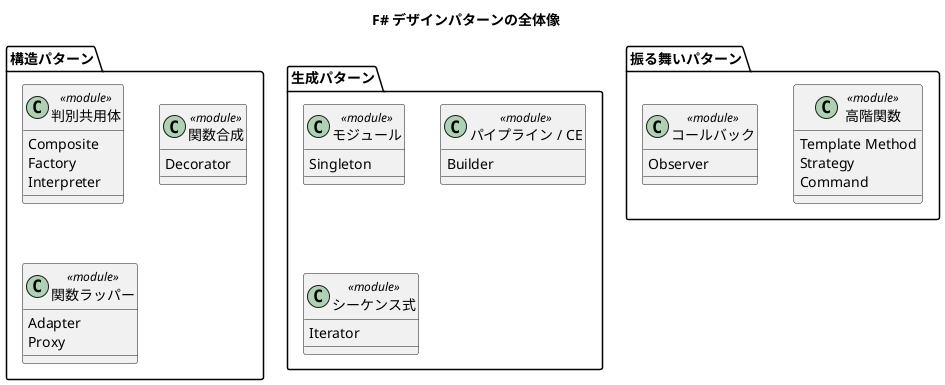

# 第 16 章：F# らしい設計 — 関数型イディオムとしてのパターン

## はじめに

最終章では、デザインパターンを超えて、F# らしい設計のイディオムを振り返ります。本シリーズで学んだ言語機能を、日常の開発でどう活かすかを考えます。

## F# の設計イディオム

### 1. 型で不正な状態を排除する

判別共用体を使って、ドメインの制約を型システムに落とし込みます。

```fsharp
// 不正な状態を許す設計
type Order = { Status: string; ShippedDate: DateTime option }

// 型で不正な状態を排除する設計
type Order =
    | Draft of items: Item list
    | Confirmed of items: Item list * confirmedAt: DateTime
    | Shipped of items: Item list * shippedAt: DateTime
```

`Draft` の注文に `shippedAt` がセットされることはあり得ません。型が不正な状態をコンパイル時に排除します。

### 2. Result 型でエラーを値として扱う

```fsharp
// 例外を投げる設計
let divide a b =
    if b = 0.0 then failwith "ゼロ除算"
    else a / b

// Result でエラーを値として扱う設計
let divide a b =
    if b = 0.0 then Error "ゼロ除算"
    else Ok (a / b)
```

Interpreter パターンで見たように、`Result` 型はエラーの伝播を型安全にします。

### 3. パイプラインでデータフローを表現する

```fsharp
let processOrder order =
    order
    |> validate
    |> Result.bind calculateTotal
    |> Result.map applyDiscount
    |> Result.map generateInvoice
```

Builder パターンで見たパイプラインは、データ変換の一般的なイディオムです。

### 4. イミュータビリティをデフォルトにする

```fsharp
// レコード型の with 式で新しいインスタンスを返す
let updateSalary employee newSalary =
    { employee with Salary = newSalary }
```

Singleton パターンで見たように、設定の変更は新しいインスタンスを返す関数で表現します。

### 5. モジュールで関連する関数をまとめる

```fsharp
module OrderModule =
    let create items = Draft items
    let confirm order = ...
    let ship order = ...
```

F# のモジュールは、名前空間と関数のグルーピングを提供し、Singleton の役割も果たします。

## パターンを超えて

デザインパターンは設計の語彙を提供してくれます。しかし、F# での設計はパターンの適用ではなく、以下の原則に基づきます。

1. **型で意図を表現する** — 判別共用体、レコード型、Option、Result
2. **関数で振る舞いを表現する** — 高階関数、関数合成、パイプライン
3. **イミュータビリティをデフォルトにする** — with 式、新しいインスタンスの返却
4. **パターンマッチングで網羅的に処理する** — コンパイラが漏れを検出

## 本シリーズのまとめ



GoF パターンの多くは、関数型言語では言語機能で自然に代替されます。しかし、パターンの「意図」を理解していることは、どの言語パラダイムでも設計の質を高めてくれます。

F# では、パターンを明示的に適用するのではなく、言語が提供するイディオムを使って自然にコードを書くことで、パターンが「溶け込んだ」設計が実現されます。

## おわりに

本シリーズを通じて、以下のことを学びました。

- 13 の GoF パターンを F# でどう表現するか
- 判別共用体、高階関数、関数合成がパターンをどう簡素化するか
- F# らしい設計のイディオムとは何か

「Simple made easy.」 — 複雑さを排除し、シンプルな設計を追求することが、よいソフトウェアへの道です。
