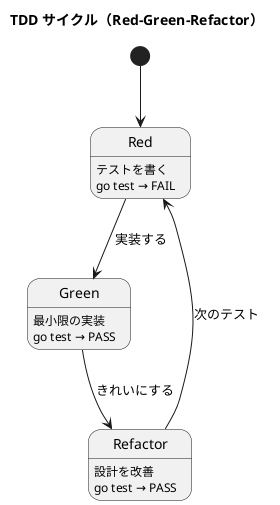

# 第 3 章: 開発環境と TDD 基盤

## はじめに

本シリーズでは Go の標準テストパッケージ `testing` を使って TDD を実践します。外部ライブラリは使わず、Go の標準ツールチェーンだけで完結します。

---

## プロジェクト構成

```
apps/go/design-pattern/
├── go.mod
├── templatemethod/
│   ├── templatemethod.go
│   └── templatemethod_test.go
├── strategy/
│   ├── strategy.go
│   └── strategy_test.go
├── observer/
├── composite/
├── iterator/
├── command/
├── adapter/
├── proxy/
├── decorator/
├── singleton/
├── factory/
├── builder/
└── interpreter/
```

各パターンは独立したパッケージとして実装します。テストファイルは同じパッケージ内に配置します。

---

## Go の TDD サイクル



### Red: 失敗するテストを書く

```go
func TestHtmlReport(t *testing.T) {
    output := GenerateReport(HtmlFormat(), "月次報告", []string{"順調"})
    if !strings.Contains(output, "<html>") {
        t.Error("HTML 出力に <html> が含まれていない")
    }
}
```

### Green: テストを通す最小のコードを書く

```go
func GenerateReport(format ReportFormat, title string, text []string) string {
    header := format.Header(title)
    body := strings.Join(text, "\n")
    footer := format.Footer()
    return header + body + footer
}

type ReportFormat struct {
    Header func(title string) string
    Footer func() string
}

func HtmlFormat() ReportFormat {
    return ReportFormat{
        Header: func(title string) string {
            return "<html><body><h1>" + title + "</h1>"
        },
        Footer: func() string {
            return "</body></html>"
        },
    }
}
```

この段階でもハードコードはやめて、後続の Strategy 章へつながる `ReportFormat` の差し替えポイントを先に置いておきます。

### Refactor: 設計を改善する

テストが通った状態で、重複を排除し、命名を改善します。

---

## テスト実行コマンド

```bash
# 全テスト実行
go test ./...

# 詳細出力
go test ./... -v

# 特定パッケージ
go test ./templatemethod/

# カバレッジ
go test ./... -cover
```

---

## Go テストのベストプラクティス

| プラクティス | 説明 |
|------------|------|
| テーブル駆動テスト | `[]struct` でテストケースをまとめる |
| `t.Helper()` | ヘルパー関数でエラー行を正しく表示 |
| `t.TempDir()` | テスト用一時ディレクトリの自動管理 |
| `t.Parallel()` | テストの並列実行 |
| サブテスト | `t.Run("名前", func(t *testing.T) {...})` |

---

## 他言語との比較

| 観点 | Ruby | Java | Python | JavaScript | Go |
|------|------|------|--------|------------|-----|
| テストフレームワーク | RSpec/Minitest | JUnit | pytest | Jest | testing（標準） |
| アサーション | expect/assert | assertEquals | assert | expect | `if ... t.Error()` |
| モック | RSpec mocks | Mockito | unittest.mock | jest.fn() | interface + stub |
| テスト実行 | rake test | mvn test | pytest | npm test | go test ./... |
| カバレッジ | SimpleCov | JaCoCo | coverage | Jest built-in | go test -cover |

**Go の特徴**: 外部ライブラリなしで TDD を実践できます。アサーション関数がない代わりに、`if` 文と `t.Error()` / `t.Errorf()` で明示的にチェックします。

---

## 静的コード解析: go vet

Go は標準ツールチェーンに静的解析ツール `go vet` が組み込まれています。外部ツールのインストールは不要で、`go` コマンドだけで実行できます。

### go vet とは

`go vet` は Go のコードを静的に解析し、コンパイラでは検出できない疑わしい構文を報告します。

```bash
# 全パッケージを解析
go vet ./...

# 特定パッケージのみ
go vet ./templatemethod/
```

### 検出できる問題の例

| チェック項目 | 説明 |
|------------|------|
| `printf` | フォーマット文字列と引数の型の不一致 |
| `shadow` | 変数のシャドウイング |
| `structtag` | 構造体タグの書式エラー |
| `unreachable` | 到達不可能なコード |
| `unusedresult` | 無視された戻り値 |
| `copylocks` | ロックのコピー検出 |

### より高度な静的解析

標準の `go vet` に加えて、より厳密なチェックを行う外部ツールも利用できます。

| ツール | 用途 |
|--------|------|
| [staticcheck](https://staticcheck.io/) | Go の包括的な静的解析ツール |
| [golangci-lint](https://golangci-lint.run/) | 複数の linter を統合して実行 |

本シリーズでは標準の `go vet` のみを使用します。

---

## コード複雑度のチェック

Go の標準ツールには循環的複雑度のチェック機能はありませんが、`go vet` のチェックと Go の設計哲学（シンプルさ重視）を組み合わせることで十分な品質を維持できます。

Go のコーディングスタイルでは以下を推奨しています:

- 関数は短く、1 つのことだけを行う
- 早期リターン（guard clause）でネストを減らす
- エラーハンドリングは呼び出し側で即座に行う

---

## 品質チェックの一括実行

`Makefile` を使って、静的解析とテストを一括実行できます。

### Makefile

```makefile
.PHONY: vet test check

vet:
	go vet ./...

test:
	go test ./...

check: vet test
```

### 実行

```bash
make check
```

`make check` は `go vet ./...` と `go test ./...` を順番に実行します。vet で問題が検出された場合、テストは実行されません。

---

## 各言語の品質ツール比較

| 用途 | Go | Ruby | Java | TypeScript | Python |
|------|-----|------|------|-----------|--------|
| 静的解析 | go vet | RuboCop | Checkstyle + PMD | ESLint | Ruff |
| フォーマッター | gofmt / goimports | RuboCop | Checkstyle | Prettier | Ruff |
| カバレッジ | go test -cover | SimpleCov | JaCoCo | @vitest/coverage-v8 | pytest-cov |
| 複雑度チェック | (外部ツール) | RuboCop Metrics | PMD | ESLint complexity | Ruff McCabe |
| 一括実行 | `make check` | `rake check` | `./gradlew check` | `npm run lint && npm test` | `ruff check && pytest` |

**Go の特徴**: `go vet` と `gofmt` が標準ツールチェーンに含まれており、外部依存なしで品質チェックを実行できます。

---

## まとめ

| 観点 | 内容 |
|------|------|
| **テストフレームワーク** | 標準 `testing` パッケージのみ |
| **プロジェクト構成** | パターンごとに独立したパッケージ |
| **TDD サイクル** | Red → Green → Refactor を数分以内に |
| **静的解析** | `go vet ./...` で疑わしい構文を検出 |
| **品質チェック** | `make check` で vet + test を一括実行 |
| **次章** | Template Method パターン — 関数フィールドで骨格を定義 |
