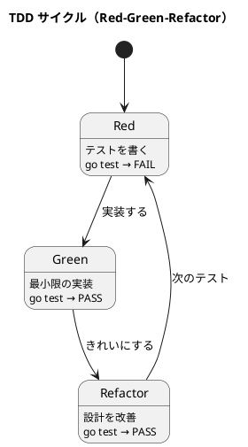

# 第 3 章: 開発環境と TDD 基盤

## はじめに

本シリーズでは Go の標準テストパッケージ `testing` を使って TDD を実践します。外部ライブラリは使わず、Go の標準ツールチェーンだけで完結します。

---

## プロジェクト構成

```
apps/go/design-pattern/
├── go.mod
├── templatemethod/
│   ├── templatemethod.go
│   └── templatemethod_test.go
├── strategy/
│   ├── strategy.go
│   └── strategy_test.go
├── observer/
├── composite/
├── iterator/
├── command/
├── adapter/
├── proxy/
├── decorator/
├── singleton/
├── factory/
├── builder/
└── interpreter/
```

各パターンは独立したパッケージとして実装します。テストファイルは同じパッケージ内に配置します。

---

## Go の TDD サイクル



### Red: 失敗するテストを書く

```go
func TestHtmlReport(t *testing.T) {
    output := GenerateReport(HtmlFormat(), "月次報告", []string{"順調"})
    if !strings.Contains(output, "<html>") {
        t.Error("HTML 出力に <html> が含まれていない")
    }
}
```

### Green: テストを通す最小のコードを書く

```go
func GenerateReport(format ReportFormat, title string, text []string) string {
    // テストを通す最小限の実装
    return "<html>"
}
```

### Refactor: 設計を改善する

テストが通った状態で、重複を排除し、命名を改善します。

---

## テスト実行コマンド

```bash
# 全テスト実行
go test ./...

# 詳細出力
go test ./... -v

# 特定パッケージ
go test ./templatemethod/

# カバレッジ
go test ./... -cover
```

---

## Go テストのベストプラクティス

| プラクティス | 説明 |
|------------|------|
| テーブル駆動テスト | `[]struct` でテストケースをまとめる |
| `t.Helper()` | ヘルパー関数でエラー行を正しく表示 |
| `t.TempDir()` | テスト用一時ディレクトリの自動管理 |
| `t.Parallel()` | テストの並列実行 |
| サブテスト | `t.Run("名前", func(t *testing.T) {...})` |

---

## 他言語との比較

| 観点 | Ruby | Java | Python | JavaScript | Go |
|------|------|------|--------|------------|-----|
| テストフレームワーク | RSpec/Minitest | JUnit | pytest | Jest | testing（標準） |
| アサーション | expect/assert | assertEquals | assert | expect | `if ... t.Error()` |
| モック | RSpec mocks | Mockito | unittest.mock | jest.fn() | interface + stub |
| テスト実行 | rake test | mvn test | pytest | npm test | go test ./... |
| カバレッジ | SimpleCov | JaCoCo | coverage | Jest built-in | go test -cover |

**Go の特徴**: 外部ライブラリなしで TDD を実践できます。アサーション関数がない代わりに、`if` 文と `t.Error()` / `t.Errorf()` で明示的にチェックします。

---

## まとめ

| 観点 | 内容 |
|------|------|
| **テストフレームワーク** | 標準 `testing` パッケージのみ |
| **プロジェクト構成** | パターンごとに独立したパッケージ |
| **TDD サイクル** | Red → Green → Refactor を数分以内に |
| **次章** | Template Method パターン — 関数フィールドで骨格を定義 |
