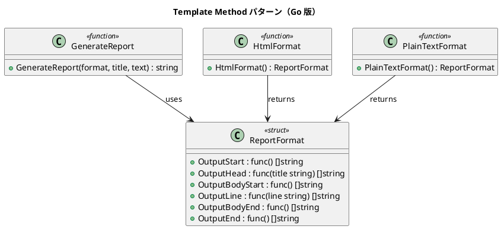

# 第 4 章: Template Method

## はじめに

レポートを HTML とプレーンテキストの 2 つの形式で出力したいとします。出力の「骨格」は同じ（タイトル → 本文 → フッター）ですが、各ステップの具体的な処理は形式ごとに異なります。

**Template Method パターン**は、アルゴリズムの骨格を定義し、具体的なステップを差し替え可能にするパターンです。

Go には継承がないため、関数フィールドを持つ struct でテンプレートを表現します。

---

## パターンの構造



**登場人物**:

- **ReportFormat（struct）**: 各ステップを関数フィールドとして保持
- **GenerateReport（関数）**: テンプレートメソッド — 骨格を定義
- **HtmlFormat / PlainTextFormat（ファクトリ関数）**: 具体的なステップを設定して返す

---

## TDD で作る

### Red: テストを書く

```go
func TestHtmlReport(t *testing.T) {
    output := GenerateReport(HtmlFormat(), "月次報告", []string{"順調", "最高の調子"})

    if !strings.Contains(output, "<html>") {
        t.Error("HTML 出力に <html> が含まれていない")
    }
    if !strings.Contains(output, "<title>月次報告</title>") {
        t.Error("HTML 出力にタイトルが含まれていない")
    }
}

func TestPlainTextReport(t *testing.T) {
    output := GenerateReport(PlainTextFormat(), "月次報告", []string{"順調", "最高の調子"})

    if !strings.Contains(output, "**** 月次報告 ****") {
        t.Error("プレーンテキスト出力にタイトルが含まれていない")
    }
    if strings.Contains(output, "<html>") {
        t.Error("プレーンテキスト出力に HTML タグが含まれている")
    }
}
```

### Green: 実装する

**ReportFormat struct** — 各ステップを関数フィールドで保持します。

```go
type ReportFormat struct {
    OutputStart     func() []string
    OutputHead      func(title string) []string
    OutputBodyStart func() []string
    OutputLine      func(line string) []string
    OutputBodyEnd   func() []string
    OutputEnd       func() []string
}
```

**GenerateReport** — テンプレートメソッドです。nil チェックにより、未設定のステップを安全にスキップします。

```go
func GenerateReport(format ReportFormat, title string, text []string) string {
    var lines []string
    if format.OutputStart != nil {
        lines = append(lines, format.OutputStart()...)
    }
    if format.OutputHead != nil {
        lines = append(lines, format.OutputHead(title)...)
    }
    // ... 同様に各ステップを実行
    return strings.Join(lines, "\n")
}
```

**HtmlFormat / PlainTextFormat** — 関数フィールドを設定して返します。

```go
func HtmlFormat() ReportFormat {
    return ReportFormat{
        OutputStart: func() []string { return []string{"<html>"} },
        OutputHead: func(title string) []string {
            return []string{" <head>", "  <title>" + title + "</title>", " </head>"}
        },
        // ...
    }
}
```

### Refactor: 振り返り

- Go には継承がないため、関数フィールドでフックポイントを表現しました
- nil チェックが「デフォルト実装（何もしない）」の役割を果たします
- 新しいフォーマットは `ReportFormat` を返す新しい関数を定義するだけで追加できます

---

## Ruby / Java / Python / JavaScript との比較

| 観点 | Ruby | Java | Python | JavaScript | Go |
|------|------|------|--------|------------|-----|
| 骨格の定義 | 基底クラス | abstract class | 基底クラス | class | struct + 関数 |
| ステップの差し替え | メソッドオーバーライド | @Override | メソッドオーバーライド | メソッドオーバーライド | 関数フィールド |
| 抽象メソッド | `raise NotImplementedError` | `abstract` | `raise NotImplementedError` | `throw new Error()` | nil チェック |
| フックメソッド | 空メソッド | 空メソッド | `pass` | 空配列返却 | nil（未設定）|

**Go の特徴**: 継承の代わりに「データとしての関数」を使います。関数フィールドを持つ struct は、本質的にはストラテジーの集合体です。

---

## まとめ

| 観点 | 内容 |
|------|------|
| **意図** | アルゴリズムの骨格を定義し、一部のステップを差し替え可能にする |
| **Go での実現** | 関数フィールドを持つ struct + テンプレート関数 |
| **メリット** | 継承階層なしで拡張可能、nil による安全なデフォルト |
| **注意点** | 関数フィールドが多すぎると struct が肥大化する |
| **関連パターン** | Strategy（次章 — 関数型を使った委譲） |
