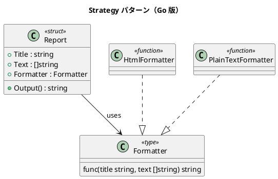

# 第 5 章: Strategy

## はじめに

前章の Template Method では関数フィールドを持つ struct でアルゴリズムの骨格を定義しました。Strategy パターンは、アルゴリズム全体を関数として切り出し、実行時に差し替え可能にするパターンです。

Go では関数が第一級の値であるため、Strategy パターンは関数型（function type）で自然に表現できます。

---

## パターンの構造



**登場人物**:

- **Formatter（関数型）**: 戦略のインターフェース
- **Report（struct）**: 戦略を使うコンテキスト
- **HtmlFormatter / PlainTextFormatter（関数）**: 具体的な戦略

---

## TDD で作る

### Red: テストを書く

```go
func TestHtmlFormatter(t *testing.T) {
    report := &Report{
        Title:     "月次報告",
        Text:      []string{"順調", "最高の調子"},
        Formatter: HtmlFormatter,
    }
    output := report.Output()

    if !strings.Contains(output, "<html>") {
        t.Error("HTML 出力に <html> が含まれていない")
    }
}

func TestSwitchFormatter(t *testing.T) {
    report := &Report{Title: "報告", Text: []string{"内容"}, Formatter: HtmlFormatter}
    report.Formatter = PlainTextFormatter
    output := report.Output()

    if strings.Contains(output, "<html>") {
        t.Error("フォーマッタ切り替え後も HTML が出力されている")
    }
}
```

### Green: 実装する

```go
type Formatter func(title string, text []string) string

type Report struct {
    Title     string
    Text      []string
    Formatter Formatter
}

func (r *Report) Output() string {
    if r.Formatter == nil {
        return ""
    }
    return r.Formatter(r.Title, r.Text)
}

func HtmlFormatter(title string, text []string) string {
    // HTML 形式でフォーマット
}

func PlainTextFormatter(title string, text []string) string {
    // プレーンテキスト形式でフォーマット
}
```

### Refactor: 振り返り

- 関数型 `Formatter` がインターフェースの役割を果たします
- `report.Formatter = PlainTextFormatter` で実行時に戦略を差し替えられます
- 無名関数やクロージャも戦略として使えます

---

## Ruby / Java / Python / JavaScript との比較

| 観点 | Ruby | Java | Python | JavaScript | Go |
|------|------|------|--------|------------|-----|
| 戦略の型 | Proc / Lambda | interface | 関数 | 関数 | 関数型 |
| コンテキスト | クラス | クラス | クラス | クラス | struct |
| 差し替え | 代入 | setter | 代入 | 代入 | フィールド代入 |
| 無名戦略 | Lambda | Lambda | Lambda | アロー関数 | 無名関数 |

**Go の特徴**: `type Formatter func(...)` で関数型を定義することで、型安全かつシンプルに戦略パターンを実現できます。

---

## まとめ

| 観点 | 内容 |
|------|------|
| **意図** | アルゴリズムをカプセル化し、実行時に差し替え可能にする |
| **Go での実現** | 関数型（function type）をフィールドに持つ struct |
| **メリット** | interface 定義不要、関数がそのまま戦略になる |
| **注意点** | 状態を持つ戦略が必要な場合はクロージャか struct + メソッドを使う |
| **関連パターン** | Template Method（骨格 + フック）、Command（操作のカプセル化） |

